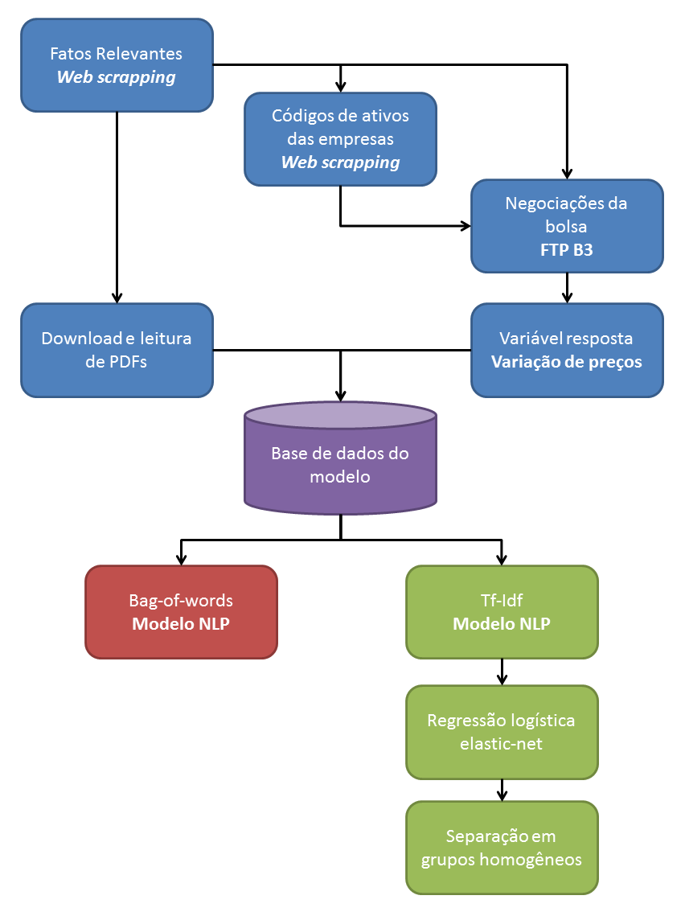
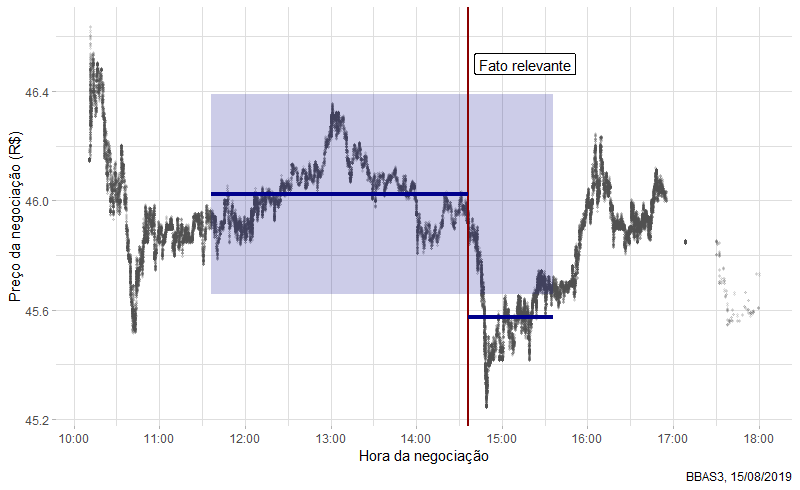
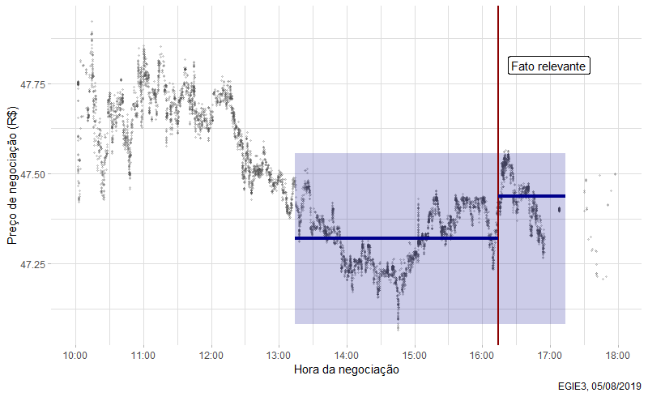

<style>
p.caption {
  font-style: italic;
}
</style>

\

# Introdução {-#introducao}

```{r echo=FALSE, warning=FALSE}
library(kableExtra)

knitr::opts_chunk$set(eval = FALSE, message = FALSE, warning = FALSE)
```


*Insider information* é um fato não-público a respeito de empresas com ativos negociados na bolsa de valores que pode garantir vantagem no mercado. O uso dessas informações em negociações, segundo a legislação brasileira, é uma prática ilegal, denominada por *insider trading*. A ocorrência de casos de uso indevido de informações privilegiadas é rara no Brasil, contudo, seu monitoramento é importante para garantir a imagem e confiança da corretora responsável perante seus clientes e reguladores.

A Comissão de Valores Imobiliários (CVM) exige que empresas listadas na bolsa de valores (B3) informem ao público fatos relevantes. Alguns destes fatos publicados podem ter maior ou menor impacto nos preços de ativos do mercado. Por exemplo, dados econômicos podem direcionar as decisões de investidores, enquanto mudanças de regimento interno de comitês não causam abalos no mercado.

Neste projeto, é desenvolvido um modelo baseado em técnicas de Processamento de Linguagem Natural (*Natural Language Processing*, NLP) para auxiliar na identificação de possíveis casos de *insider trading* através da leitura e classificação dos documentos de fatos relevantes de acordo com o impacto nas ações.

* Na Seção 1, "Mineração e estruturação de dados", mostramos como foi feita a coleta e estruturação de dados de diferentes fontes e diferentes formatos para a criação das variáveis do modelo.

* Na Seção 2, "Modelagem", são apresentados os resultados do modelo NLP de regressão logística com regularização *elastic net*. Os resultados são divididos em grupos homogêneos, analogamente a técnicas comumente aplicadas em *credit scoring*, com o objetivo de selecionar os casos mais críticos para analistas.

* A Seção 3, "Conclusão", apresenta sugestões de aplicação, bem como melhorias ao modelo *baseline* desenvolvido.

O projeto faz uso de várias fonte externas para construir a base de dados do modelo. A figura abaixo é um esquema do fluxo de cada um dos passos detalhados nas seções a seguir.

\

```{r eval=TRUE, echo=FALSE, fig.cap="Esquema do projeto.", out.width="60%", fig.align="center"}

```

\

## Observações {-#obs}

* Os códigos estão majoritamente escritos em linguagem `R` (incluindo este documento, em R Markdown). Casos de códigos em `Python` ou `SQL` são devidamente indicados no texto.

* Os seguintes pacotes R foram usados durante o projeto. Para melhor leitura, os pacotes são indicados como comentários no início do código conforme necessários.

```{r eval=TRUE}
library(readr)      # Read files
library(dplyr)      # Data manipulation
library(stringr)    # String manipulation
library(lubridate)  # Date and time manipulation
library(rvest)      # Web scrapping
library(curl)       # Web client
library(xml2)       # Web scrapping
library(purrr)      # Functional programming
library(hms)        # Time-of-day tools
library(bizdays)    # Business days utilities
library(vroom)      # Fast file reading
library(data.table) # Data manipulation
library(httr)       # HTTP tools
library(pdftools)   # PDF reading
library(tm)         # Text mining
library(caret)      # Classification and regression models
library(ggplot2)    # Data visualization
```

* Devido ao tamanho grande dos arquivos de dados, como negociações da bolsa de valores, estes não são incluídos em sua totalidade. No repositório github, é possível encontrar exemplos de alguns desses arquivos processados.

\

# Mineração e estruturação de dados {#data-mining}

## *Web scrapping* dos fatos relevantes {#web-scrapping}

Os fatos relevantes podem ser consultados por data e/ou empresa no [site da CVM](https://www.rad.cvm.gov.br/ENET/frmConsultaExternaCVM.aspx). Devido à estrutura do site, foi necessário criar um processo por *webdriver* para obter os registros de fatos relevantes de cada mês de forma automatizada. O código abaixo, em `Python`, utiliza o [Selenium](https://selenium-python.readthedocs.io/) para fazer o *web scrapping* das informações. É necessário apenas entrar com as datas inicial e final do mês desejado na variável `dates`.

```{python web_scrap}
# PYTHON 3 CODE

from selenium import webdriver
from selenium.webdriver.common.by import By
from selenium.webdriver.support.ui import WebDriverWait
from selenium.webdriver.support import expected_conditions as EC

import pandas as pd
import numpy as np

# Definir datas inicial e final -----------------------------------------------
dates = pd.date_range(start = "2019-10-01", end = "2019-10-31")


# Exemplo com Chrome
driver = webdriver.Chrome("C:/seleniumDriver/ChromeDriver/chromedriver.exe")
driver.get("https://www.rad.cvm.gov.br/ENET/frmConsultaExternaCVM.aspx")

wait = WebDriverWait(driver, 60)
element = wait.until(EC.element_to_be_clickable((By.ID, "rdPeriodo")))

driver.find_element_by_id("rdPeriodo").click()

wait = WebDriverWait(driver, 3)
element = wait.until(EC.element_to_be_clickable((By.ID, "txtDataIni")))

fatos_relevantes = pd.DataFrame()

for date in dates:
    driver.find_element_by_id("txtDataIni").clear()
    driver.find_element_by_id("txtDataIni").send_keys(date.strftime("%d/%m/%Y"))

    driver.find_element_by_id("txtDataFim").clear()
    driver.find_element_by_id("txtDataFim").send_keys(date.strftime("%d/%m/%Y"))

    driver.find_element_by_id("btnConsulta").click()

    wait = WebDriverWait(driver, 180)
    element = wait.until(EC.invisibility_of_element_located((By.ID, "divLoading")))
    
    df = pd.DataFrame()

    while True:
        table = driver.find_element_by_id("grdDocumentos").get_attribute("outerHTML")
        table = pd.read_html(table, encoding = "latin-1")
        table = table[0]
        
        col = []
        
        if table.iloc[0, 0] != "Não há dados disponíveis":
            for i in range(len(table.index)):
                dl_xpath = '//*[@id="grdDocumentos"]/tbody/tr[' + \
                            str(i + 1) + ']/td[11]/i[2]'
                # Get file download parameters
                dl = driver.find_element_by_xpath(dl_xpath).get_attribute("onclick")
                
                col += [dl]
            
            table["download"] = col
            
            df = df.append(table)
        
        if "disabled" in driver.find_element_by_id("grdDocumentos_next").get_attribute("class"):
            break
        else:
            driver.find_element_by_id("grdDocumentos_next").click()
    
    fatos_relevantes = fatos_relevantes.append(df)
    
    driver.find_element_by_id("filtrosPesquisa").click()
    
    wait = WebDriverWait(driver, 3)
    element = wait.until(EC.element_to_be_clickable((By.ID, "txtDataIni")))

fatos_relevantes = fatos_relevantes.drop(columns = "Ações")

fatos_relevantes = fatos_relevantes.replace("-", np.nan)

fatos_relevantes.columns = ["codigo_cvm", "empresa", "categoria", "tipo", 
                             "especie", "data_referencia", "dttm_entrega", 
                             "status", "v", "modalidade", "download"]

fatos_relevantes.to_csv(path_or_buf = (
  "datasets/pt-br/fatos_relevantes_" + date.strftime("%Y%m") + ".csv",
  index = False)

driver.close()
```

A tabela abaixo é um exemplo das primeiras linhas do CSV gerado. As colunas importantes para o modelo são:
 
* `codigo_cvm`: código da empresa listada
* `empresa`: nome da empresa
* `categoria`: categoria do fato relevante
* `dttm_entrega`: data e horário da entrega do fato relevante pela CVM
* `download`: parâmetros para baixar os arquivos anexados de cada fato relevante

Faremos o download mais adiante, já que, como veremos, nem todos os arquivos precisam ser baixados. Essa decisão *economiza tempo de processamento e espaço de armazenamento no futuro*.

```{r eval=TRUE, message=FALSE, warning=FALSE, results='asis', fig.cap=""}
# library(readr)
# library(dplyr)
# library(stringr)
# library(lubridate)

fatos_relevantes <- read_csv("datasets/pt-br/fatos_relevantes_201908.csv")

# Limpeza de variáveis
fatos_relevantes <- fatos_relevantes %>%
  filter(status != "Cancelado") %>% 
  select(-(tipo:data_referencia), -(status:modalidade)) %>% 
  mutate(empresa = str_sub(empresa, start = 8),
         dttm_entrega = dttm_entrega %>% 
           str_sub(start = 10) %>%
           dmy_hm(),
         download = download %>% 
           str_remove_all("OpenDownloadDocumentos\\(|\\)|'") %>%
           str_split(","))
```

\

```{r eval=TRUE, echo=FALSE, results='asis'}
fatos_relevantes %>% 
  head(10) %>% 
  mutate(dttm_entrega = as.character(dttm_entrega)) %>% 
  kable() %>%
  kable_styling() %>%
  scroll_box(width = "100%", height = "400px")
```

\

## Códigos dos ativos das empresas

Note que no *data frame* anterior `fatos_relevantes` estão incluídos apenas o `codigo_cvm` e o nome da `empresa`, mas não o código do ativo (*instrument symbol*) negociado na bolsa de valores. Assim, é necessário buscar essa informação em outra fonte de dados.

Podemos consultar as [Empresas Listadas](http://www.b3.com.br/pt_br/produtos-e-servicos/negociacao/renda-variavel/empresas-listadas.htm) no site da B3 para obter *alguns* dos códigos de ativos. Nem todos os códigos estão listados, como ações fracionárias, mas é suficiente obter os quatro primeiros dígitos do código para encontrar todos os ativos relacionados a uma empresa.

Por exemplo, a Petrobras ("PETROLEO BRASILEIRO S.A. PETROBRAS") tem listados os códigos de negociação PETR3 e PETR4. A partir da base do código, **PETR**, é possível identificar todos os ativos negociados por essa empresa, como **PETR**4F (fracionário) e **PETRL**30 (e muitas outras no mercado de opções).

Aqui é preciso fazer outro processo de *web scrapping*, mas sem a necessidade de usar o `selenium`. É possível ir direto ao link de cada empresa a partir do `codigo_cvm` e ler o conteúdo da página HTML diretamente com o pacote [rvest](https://github.com/tidyverse/rvest), o que torna o processo mais simples e rápido.

```{r cod_ativo}
# library(rvest)

codigos_cvm <- file_path %>% 
  read_csv() %>% 
  pull(codigo_cvm) %>% 
  str_remove("-") %>% 
  as.numeric() %>% 
  unique()

extract_cod_ativo <- function(cod_cvm) {
  url <- paste0("http://bvmf.bmfbovespa.com.br/cias-listadas/empresas-listadas/",
                "ResumoEmpresaPrincipal.aspx?codigoCvm=", cod_cvm)
  
  read_html(url) %>% 
    html_nodes("iframe") %>% 
    magrittr::extract(2) %>% 
    html_attr("src") %>%
    str_remove("../../") %>% 
    str_c("http://bvmf.bmfbovespa.com.br/", .) %>% 
    read_html() %>%
    html_nodes('table[class="ficha responsive"]') %>% 
    html_children() %>% 
    magrittr::extract(2) %>% 
    html_nodes("a") %>% 
    html_text() %>% 
    setdiff("Mais Códigos")
}

codigos_ativo <- purrr::map(codigos_cvm, extract_cod_ativo)

df_ativos <- purrr::map2_dfr(
  codigos_ativo, codigos_cvm,
  ~ tibble(cod_cvm = .y, cod_ativo = paste(.x, collapse = ", "))
  ) %>% 
  filter(cod_ativo != "")

fatos_relevantes <- fatos_relevantes %>%
  mutate(cod_cvm = as.numeric(str_remove(codigo_cvm, "-"))) %>% 
  left_join(df_ativos, by = "cod_cvm") %>% 
  select(-cod_cvm)
```

\

## Negociações da bolsa

A B3 publica gratuitamente os dados (anônimos) de todas as negociações feitas na bolsa de valores no servidor FTP [Market Data](ftp://ftp.bmf.com.br/marketdata)[^bdi1].

[^bdi1]: Infelizmente, a B3 anunciou a alguns meses o desligamento do servidor FTP gratuito para ser substituído por um serviço pago, supostamente oferendo os mesmos dados. Isso dificulta a pesquisa e estudo dos dados por indivíduos e empresas de menor porte, mas a B3 é afinal uma companhia  privada e pode decidir pela venda de seus dados. Estão disponíveis as negociações nos mercados: 

* A vista (Equity)

* Fracionário (Equity-Odds)

* Opções (Options)

* BMF

Um grande diferencial em relação a outros serviços gratuitos populares, como [Yahoo Finance](https://finance.yahoo.com/), é o nível de detalhe dos dados: há o registro com precisão de microsegundos de cada negociação. Isso permite estudos mais diversificados, uma vez que não estamos confinados em agregações diárias.

Os dados estão armazenados em arquivos de texto compactados (.zip/.gz), separados por mercado e dia de negociação[^bdi2]. O código abaixo define três funções, `bdi_get_ftp()`, `bdi_download()` e `bdi_read()`, para encontrar, baixar e ler esses arquivos brutos. As funções são fortemente inspiradas no pacote [GetHFData](https://cran.r-project.org/web/packages/GetHFData/index.html). Vamos lidar apenas com os arquivos de negociação (`NEG_***`). A estrutura completa dos arquivos pode ser consultada no próprio Market Data ([português](ftp://ftp.bmf.com.br/marketdata/NEG_LAYOUT_portuguese.txt) e [inglês](ftp://ftp.bmf.com.br/marketdata/NEG_LAYOUT_english.txt)).

> Alguns dos arquivos são grandes: cerca de 1 GB quando descompactado! Ao final do processamento, são gerados arquivos CSV de ~350 MB. Por esse motivo, pode ser necessário realizar o processamento abaixo em *chunks* dependendo da capacidade de memória RAM do computador em uso.

[^bdi2]: Antes o upload de arquivos era feito diariamente, mas com o futuro desligamento do servidor, acredito que a prioridade mudou e o upload normalmente acontece com mais de um mês de atraso.

```{r bdi_functions}
# require(curl)
# require(xml2)


bdi_get_ftp <- function(market_type = c("Equity", "Equity-Odds", "Options", "BMF"), 
                        data_type = c("trades", "orders")) {
  # Lê o conteúdo do servidor FTP para negociações/ordens do tipo de mercado
  # especificado e gera um dataframe contendo informações sobre os arquivos
  # disponíveis para download.
  #
  # Argumentos:
  # `market_type`   Tipo de mercado, conforme separação da B3
  # `data_type`     Tipo de arquivo: negociações ou ordens
  
  market_type <- match.arg(market_type)
  
  data_type <- match.arg(arg = data_type)
  
  if (!curl::has_internet()) {
    stop("Internet connection not found.")
  }
  
  ftp_path <-  paste0(
    "ftp://ftp.bmf.com.br/MarketData/",
    case_when(
      any(market_type == c("Equity", "Equity-Odds")) ~ "Bovespa-Vista/",
      market_type == "Options"                       ~ "Bovespa-Opcoes/",
      market_type == "BMF"                           ~ "BMF/"
    )
  )
  
  if (data_type == "trades") {
    files_pattern <- "NEG_(.*?)\\.(zip|gz)"
  } else {
    files_pattern <- "OFER_(.*?)\\.(zip|gz)"
  }
  
  cat("Reading ftp contents for ", market_type, " (", data_type, ")\n", sep = "")
  
  ftp_files <- read_html(ftp_path) %>%
    xml_find_all("//tr") %>%
    xml_children() %>%
    xml_text(trim = TRUE) %>%
    matrix(ncol = 4, byrow = TRUE) %>%
    `[`(c(-1, -2), c(-1, -4))
  
  tbl_ftp <- tibble(
    market = market_type,
    file_name = ftp_files[, 1],
    date = str_extract(ftp_files[, 1], pattern = "[0-9]{8}"),
    file_size = case_when(
      str_detect(ftp_files[, 2], "MB") ~ 
        as.numeric(str_extract(ftp_files[, 2], "[0-9]+")) * 1024^2,
      str_detect(ftp_files[, 2], "KB") ~ 
        as.numeric(str_extract(ftp_files[, 2], "[0-9]+")) * 1024,
      str_detect(ftp_files[, 2], "bytes") ~ 
        as.numeric(str_extract(ftp_files[, 2], "[0-9]+")),
      TRUE ~ NA_real_
    ),
    url = paste0(ftp_path, ftp_files[, 1])
  ) %>%
    mutate(date = ymd(date)) %>%
    filter(str_detect(file_name, pattern = files_pattern))
  
  # remove or not FRAC market files
  if (market_type == "Equity-Odds") {
    tbl_ftp <- filter(tbl_ftp, str_detect(file_name, pattern = "FRAC"))
  } else {
    tbl_ftp <- filter(tbl_ftp, str_detect(file_name, pattern = "FRAC", negate = TRUE))
  }
  
  if (data_type == "orders") {
    tbl_ftp <- tbl_ftp %>%
      mutate(order_type = ifelse(str_detect(file_name, pattern = "VDA"),
                                 "Sell", "Buy")) %>% 
      select(market, order_type, everything()) %>% 
      group_by(order_type)
  }
  
  tbl_ftp <- tbl_ftp %>% 
    mutate(file_warning = file_size < mean(file_size) - 2 * sd(file_size)) %>% 
    ungroup()
  
  if (sum(tbl_ftp$file_warning) > 0) {
    warning("Some files seem to be corrupted. Consider revising the files ",
            "where `file_warning` column's value is TRUE.")
  }
  
  return(tbl_ftp)
}


bdi_download <- function(file_name, url, file_size, ..., dest_dir = getwd(), max_tries = 10L) {
  # Faz o download dos arquivos especificados do Market Data. Usado em conjunto
  # com o output da função `bdi_get_ftp()`
  #
  # Argumentos:
  # `file_name`   Nome do arquivo
  # `url`         URL onde está localizado o arquivo
  # `file_size`   Tamanho aproximado do arquivo (informado no servidor FTP)
  # `dest_dir`    Caminho do diretório destino
  # `max_tries`   Número máximo de tentativas para fazer o download
  
  dest_file <- paste0(dest_dir, file_name)
  
  if (file.exists(dest_file) & file.size(dest_file) >= file_size) {
    warning("File already exists in destination directory. Skipping download.")
  } else {
    i <- 1L
    
    while (i <= max_tries) {
      download.file(url, dest_file, method = "libcurl")
      
      if (file.size(dest_file) >= file_size) {
        break
      }
      
      cat("File download has failed. Trying again [", 
          i, " of ", max_tries, "]\n", sep = "")
      
      i <- i + 1L
    }
    
    if (i == max_tries) {
      stop("Failed to download file: reached max number of attempts.
           Check connection or try again later.")
    }
  }
  
  invisible(dest_file)
}


bdi_read <- function(file) {
  # Faz a leitura e limpeza dos arquivos baixados do Market Data
  #
  # Argumentos:
  # `file`    Caminho para o arquivo
  
  col_names = c("session_date", "instrument_symbol", "trade_number", 
                "trade_price", "traded_quantity", "trade_time", 
                "trade_indicator", "buy_order_date", "buy_order_seq_number", 
                "buy_order_sec_id", "aggro_buy_order_indicator", 
                "sell_order_date", "sell_order_seq_number", "sell_order_sec_id",
                "aggro_sell_order_indicator", "cross_trade_indicator", 
                "buy_member", "sell_member")
  
  cols <- cols_only(session_date = col_date(format = "%Y-%m-%d"),
                    instrument_symbol = col_character(),
                    trade_number = col_integer(),
                    trade_price = col_number(), 
                    traded_quantity = col_number(), 
                    trade_time = col_time(format = "%H:%M:%OS"), 
                    trade_indicator = col_integer(),
                    buy_order_date = col_date(format = "%Y-%m-%d"),
                    buy_order_seq_number = col_character(),
                    buy_order_sec_id = col_character(),
                    aggro_buy_order_indicator = col_integer(), 
                    sell_order_date = col_date(format = "%Y-%m-%d"),
                    sell_order_seq_number = col_character(),
                    sell_order_sec_id = col_character(),
                    aggro_sell_order_indicator = col_integer(),
                    cross_trade_indicator = col_integer(),
                    buy_member = col_number(),
                    sell_member = col_number())
  
  cat("Reading `", file, "`\n", sep = "")
  
  df <- suppressWarnings(
    read_delim(file, delim = ";", 
               escape_double = FALSE, 
               col_names = col_names, 
               col_types = cols,
               trim_ws = TRUE, 
               skip = 1)) %>%
    # Excluir negociações canceladas
    filter(!is.na(session_date), trade_indicator == 1L) %>%
    mutate(trade_date_time = ymd_hms(paste(session_date, trade_time),
                                     tz = "America/Recife"))
  
  return(df)
}
```

Essas funções podem ser usadas em combinação com o pacote [purrr](https://purrr.tidyverse.org/) para processar os dados de negociações de todo o mês. Note que ao baixar os dados de um mês específico, como outubro no código abaixo, também incluímos o **último dia do mês anterior** e o **primeiro dia do mês seguinte**. A razão para isso ficará clara ao definirmos a variável resposta do modelo a seguir.

```{r bdi_processing}
# library(purrr)

markets <- c("Equity", "Equity-Odds", "Options", "BMF")

ftp_files <- map_dfr(markets, bdi_get_ftp) %>%
  filter(date >= "2019-09-30", date <= "2019-11-01")

ftp_files %>%
  select(file_name, url, file_size) %>%
  pwalk(bdi_download, dest_dir = "path/to/save/files")

bdi_raw <- map2_dfr(.x = tbl_files$file_name, .y = tbl_files$market,
                    ~ bdi_read(.x) %>%
                      mutate(market = factor(.y, levels = markets))) %>%
  arrange(session_date, instrument_symbol, trade_time)
```

Cada dia de negociações pode ser armazenado em um arquivo CSV, por exemplo. A tabela abaixo é um exemplo das primeiras linhas de negociação do dia 01/08/2019.

\

```{r eval=TRUE, echo=FALSE}
read_csv("datasets/2019-08-01-BDI-Raw (example).csv") %>% 
  kable() %>%
  kable_styling() %>%
  scroll_box(width = "100%", height = "400px")
```

\

## Variável resposta

Os dados de negociações obtidos anteriormente podem usados para construir uma variável resposta que identifica se houve variação significativa no preço dos ativos de uma empresa após a publicação de um fato relevante. *Não necessariamente* a variação detectada se deve ao fato relevante.

\

### Definição

A variável resposta `response_price` é uma variável lógica (`TRUE`/`FALSE`) definida da seguinte maneira:

1. Calcular a média $\mu_{antes}$ e desvio padrão $\sigma_{antes}$ de preços de **cada ativo** da empresa dentro do período de **três horas antes** do fato relevante;

2. Calcular a média $\mu_{após}$ de preços de **cada ativo** da empresa dentro do período de **uma hora após** o fato relevante;

3. Se $|\mu_{após} - \mu_{antes}| > 3 \sigma_{antes}$ para *pelo menos um ativo* da empresa a variável resposta é marcada como `TRUE`;

4. Caso contrário, a variável resposta é marcada como `FALSE`. Se não for possível calcular o desvio padrão, porque não há pontos de dados suficientes (zero ou um), a variável resposta fica marcado como `NA`.

As figuras abaixo são exemplos positivo (`TRUE`) e negativo (`FALSE`), respectivamente, da variável resposta para dois ativos. Os dois gráficos apresentam uma maneira fácil de visualizar a variável resposta: se a média de preços após o fato relevante está fora do "túnel" de $\pm 3 \sigma$, então a resposta é positiva.

\

```{r bbas3, eval=TRUE, echo=FALSE, fig.cap="Variável resposta positiva. Média após o fato relevante fora do túnel de 3 desvios padrão em relação à media antes do fato.", out.width="90%", fig.align="center"}

```

\

```{r egie3, eval=TRUE, echo=FALSE, fig.cap="Variável resposta negativa. Média após o fato relevante dentro do túnel de 3 desvios padrão em relação à media antes do fato.", out.width="90%", fig.align="center"}

```

\

O cálculo do período leva em consideração casos mais particulares. Os [horários de negociações de ações](http://www.b3.com.br/pt_br/solucoes/plataformas/puma-trading-system/para-participantes-e-traders/horario-de-negociacao/acoes/) ocorrem em dias úteis das 10h às 18h -- não são considerados os horários de cancelamento de ofertas ou de *after-market*. Por outro lado, os fatos relevantes podem ser publicados em qualquer dia ou horário. 

Assim, se um fato relevante é publicado fora do horário de negociação ou em um fim de semana/feriado, são utilizadas as últimas ou próximas horas disponíveis para definir os períodos antes e após à publicação, respectivamente. Além disso, se não for possível completar uma hora de negociação antes/após o fato relevante -- por exemplo, fatos publicados entre 10h e 11h ou entre 17h e 18h --, essa hora é complementada analogamente à regra anterior.

No código abaixo, são calculadas os limites inferior e superior do período antes e depois à entrega do fato relevante, `dttm_before` e `dttm_after`. Esses limites estão parametrizados de acordo com as variáveis `delta_before` e `delta_after` (em minutos), que definem as janelas de observação de tempo. O pacote [bizdays](http://wilsonfreitas.github.io/posts/bizdays-dias-uteis-no-r.html) apresenta várias conveniências para trabalhar com dias úteis no calendário definido pela [ANBIMA](https://www.anbima.com.br/feriados/feriados.asp).

Ao final, são excluídos os fatos relevantes de empresas em que não foi encontrado um código de ativo, ou seja, quando `is.na(base_ativo)`.

```{r response_processing}
# library(hms)
# library(bizdays)

bizdays.options$set(default.calendar="Brazil/ANBIMA")

delta_before <- 3 * 60 # 180 minutos
delta_after <- 60      #  60 minutos

n_sd <- 3L # Número de desvios-padrão para o túnel


fatos_relevantes <- fatos_relevantes %>% 
  mutate(base_ativo = str_sub(cod_ativo, end = 4)) %>% 
  mutate(
    # dttm_before = limite inferior do período anterior a `dttm_entrega`
    dttm_before = case_when(
      !is.bizday(dttm_entrega) | hour(dttm_entrega) < 10 ~ 
        as_hms((18 * 60 - delta) * 60) %>% 
        as.character() %>% 
        paste(add.bizdays(date(dttm_entrega), -1), .) %>%
        ymd_hms(),
      hms::as_hms(dttm_entrega) < (10 * 60 + delta) * 60 ~ 
        as_hms(18 * 60 * 60 - ((10 * 60 + delta) * 60 - as_hms(dttm_entrega))) %>% 
        as.character() %>%
        paste(add.bizdays(date(dttm_entrega), -1), .) %>%
        ymd_hms(),
      hour(dttm_entrega) >= 18 ~ 
        as_hms((18 * 60 - delta) * 60) %>%
        as.character() %>% 
        paste(date(dttm_entrega), .) %>%
        ymd_hms(),
      TRUE ~ dttm_entrega - minutes(delta)
    ),
    # dttm_after  = limite superior do período seguinte a `dttm_entrega`
    dttm_after = case_when(
      !is.bizday(dttm_entrega) | hour(dttm_entrega) >= 18 ~
        as_hms((10 * 60 + delta) * 60) %>% 
        as.character() %>% 
        paste(add.bizdays(date(dttm_entrega), 1), .) %>%
        ymd_hms(),
      hms::as_hms(dttm_entrega) > (18 * 60 - delta) * 60 ~ 
        as_hms(10 * 60 * 60 + (as_hms(dttm_entrega) - (18 * 60 - delta) * 60)) %>% 
        as.character() %>%
        paste(add.bizdays(date(dttm_entrega), 1), .) %>%
        ymd_hms(),
      hour(dttm_entrega) < 10 ~ 
        as_hms((10 * 60 + delta) * 60) %>%
        as.character() %>% 
        paste(date(dttm_entrega), .) %>%
        ymd_hms(),
      TRUE ~ dttm_entrega + minutes(delta)
    )
  ) %>%
  filter(!is.na(base_ativo))
```

Para calcular a variável resposta, necessitamos calcular a média e o desvio padrão para cada código de ativo relacionado a uma empresa para cada fato relevante publicado em determinado horário. Estamos buscando as negociações na mesma base `bdi_raw`, mas filtrando diferentes períodos e ativos para cada linha de `fatos_relevantes` para, então, calcular as quantidades resumo. 

Primeiramente, carregamos os arquivos da bolsa de valores processados anteriormente.

> Note que, como mencionado, são necessários os dados de negociações do último dia do mês anterior e do primeiro dia do mês seguinte pela forma como são tratados os fatos relevantes publicados fora do horário de negociação de ações.

```{r}
# library(vroom)

file_paths <- list.files("BDI-Raw/", pattern = "BDI-Raw", full.names = TRUE)

bdi_raw <- file_paths %>%
  purrr::map_dfr(vroom, ",", col_types = cols_only(session_date = "D",
                                                   trade_time = "c",
                                                   instrument_symbol = "c",
                                                   trade_price = "d",
                                                   traded_quantity = "d")) %>%
  mutate(base_instrument = str_sub(instrument_symbol, 1, 4)) %>% 
  filter(trade_time >= "10:00:00.000", trade_time <= "18:00:00.000",
         base_instrument %in% unique(fatos_relevantes$base_ativo)) %>%
  mutate(trade_dttm = ymd_hms(paste(session_date, trade_time))) %>% 
  select(-session_date, -trade_time) %>% 
  filter(market != "Options", 
         market == "BMF" | nchar(instrument_symbol) <= 6 | str_detect(instrument_symbol, "F$"))
```

O último filtro exclui os ativos do mercado de Opções (alguns ativos de opção, na verdade, estão incluídos nos arquivos de equity). Isso porque o mercado de opções possui ativos muito granulares, normalmente negociados a preços baixos em relação a equities e em menor volume, o que pode desestabilizar a variável resposta. As figuras abaixo ilustram esse problema para ativos do Bradesco. Perceba como a granularidade de dezenas de ativos de opções (BBDCH348, BBDCH358, ...) gera uma falsa percepção de oscilação de preço, já que é mais sensível a pequenas variações.

\

```{r bbdcTodos, eval=TRUE, echo=FALSE, fig.cap="Todos ativos negociados do Bradesco. Ações no mercado de opções possuem características muito distintas do mercados de equitiy e fracionário.", out.width="90%", fig.align="center"}
knitr::include_graphics("plots/bradesco_todos.png")
```

\

```{r bbdcGrid, eval=TRUE, echo=FALSE, fig.cap="Ilustração do cálculo da variável resposta para mercados equity+fracionário e opções. A granularidade e menor volume das opções pode desequilibrar o cálculo da variável resposta.", out.width="90%", fig.align="center"}
knitr::include_graphics("plots/bradesco_grid.png")
```

\

### Cálculo

Em uma query em `SQL`, o cálculo de média e desvio padrão poderia ser feito da seguinte maneira para o período *antes* do fato relevante (e analogamento para o período *depois* do fato):

```{sql connection=NULL}
-- SQL CODE

SELECT fr.doc_id,
       bdi.instrument_symbol,
       MEAN(bdi.trade_price) AS before_price_mean,
       STDEVP(bdi.trade_price) AS before_price_sd
FROM fatos_relevantes AS fr
LEFT JOIN bdi_raw as bdi
  ON (fr.base_ativo = bdi.base_instrument) AND
     (bdi.trade_dttm BETWEEN fr.dttm_before AND fr.dttm_entrega)
GROUP BY fr.doc_id, bdi.instrument_symbol;
```

Esse tipo de query é chamada de *non-equi join*, onde temos uma operação `JOIN` feita sobre uma condição de desigualdade (`>`, `<=`, `BETWEEN`, etc). Não é possível fazer esse tipo de operação diretamente com `dplyr::left_join()` seguido de `dplyr::summarise()`, pois a primeira função só trabalha em condições de igualdade. Enquanto é possível realizar um `left_join()` para todos os horários e posteriormente aplicar `filter()`, a quantidade de dados torna essa operação inviável.

A primeira tentativa, ainda usando `dplyr` e `purrr`, foi criar uma função `dplyr_summarise_fatos()` e aplicá-la a todas as linhas de `fatos_relevantes`.

```{r}
dplyr_summarise_fatos <- function(doc_id, base_ativo, dttm_entrega, dttm_before, dttm_after, ..., .side) {
  .side <- match.arg(.side, c("before", "after"))
  
  if (.side == "before") {
    dttm_interval <- interval(dttm_before, dttm_entrega)
  } else {
    dttm_interval <- interval(dttm_entrega, dttm_after)
  }
  
  result <- bdi_raw %>%
    filter(base_instrument == base_ativo,
           trade_dttm %within% dttm_interval) %>%
    group_by(instrument_symbol) %>% 
    summarise(n = n(),
              price_mean = mean(trade_price),
              price_sd = sd(trade_price)) %>%
    rename_at(c("n", "price_mean", "price_sd"), ~ paste0(.side, "_", .)) %>% 
    mutate(doc_id = doc_id)
}

before <- purrr::pmap_dfr(fatos_relevantes, dplyr_summarise_fatos, .side = "before")

after <- purrr::pmap_dfr(fatos_relevantes, dplyr_summarise_fatos, .side = "after")
```

Contudo, essa função se mostrou pouco eficiente: cerca de duas horas para processar um mês de fatos relevantes. O principal *bottleneck* é que a função `filter()` é chamada uma vez para cada código de ativo relacionado a um fato relevante, fazendo cópias no processo, para então calcular as quantidades resumo com `summarise()`.

O pacote `data.table` oferece uma alternativa mais escalável nesse caso[^dt], já que é possível realizar operações de *non-equi joins*. Com essa alternativa, o mês é processado em cerca de 3 minutos!

[^dt]: Agradecimentos a **\@Fino** pela ajuda na conversão da função em `dplyr` para `data.table` no [StackOverflow](https://stackoverflow.com/questions/59504357/filtering-and-summarising-a-dataframe-based-another-search-dataframe).

```{r dt_summarise}
# library(data.table)

dt_summarise_fatos <- function(.fatos, .side) {
  .side <- match.arg(.side, c("before", "after"))
  
  setDT(.fatos)
  setDT(bdi_raw)
  
  if (.side == "before") {
    df <- bdi_raw[.fatos,
                  on = .(trade_dttm >= dttm_before, 
                         trade_dttm <= dttm_entrega, 
                         base_instrument = base_ativo),
                  .(doc_id, 
                    base_ativo,
                    dttm_before, 
                    dttm_entrega, 
                    trade_dttm,  
                    instrument_symbol, 
                    base_instrument,
                    traded_quantity, 
                    trade_price)]
  } else {
    df <- bdi_raw[.fatos,
                  on = .(trade_dttm >= dttm_entrega, 
                         trade_dttm <= dttm_after, 
                         base_instrument = base_ativo),
                  .(doc_id, 
                    base_ativo,
                    dttm_before, 
                    dttm_entrega, 
                    trade_dttm,  
                    instrument_symbol, 
                    base_instrument,
                    traded_quantity, 
                    trade_price)]
  }
  
  df <- df[, 
           list(n = .N,
                price_mean = mean(trade_price),
                price_sd = sd(trade_price)),
           by = list(doc_id, instrument_symbol)]
  
  df %>% 
    as_tibble() %>% 
    rename_at(c("n", "price_mean", "price_sd"), ~ paste0(.side, "_", .)) %>% 
    filter(!is.na(instrument_symbol))
}

before <- dt_summarise_fatos(fatos_relevantes, "before")

after <- dt_summarise_fatos(fatos_relevantes, "after")

fatos_relevantes <- fatos_relevantes %>%
  left_join(before, by = "doc_id") %>% 
  left_join(after, by = c("doc_id", "instrument_symbol")) %>% 
  as_tibble()
```

Finalmente, podemos calcular a variável resposta `response_price`. Vamos desconsiderar os fatos relevantes em que não foi possível calcular o desvio padrão (isto é, quando `response_price` é `NA`).

```{r}
price_alerts <- fatos_relevantes %>% 
  mutate(response_price = abs(after_price_mean - before_price_mean) > n_sd * before_price_sd) %>%
  filter(!is.na(response_price)) %>% 
  mutate(instrument_symbol = if_else(response_price, instrument_symbol, "")) %>% 
  group_by(file_name) %>% 
  summarise(response_price = sum(response_price) > 0,
            ativo_response = instrument_symbol %>% 
              str_c(collapse = " ") %>% 
              str_squish() %>% 
              na_if(""))

fatos_final <- fatos_relevantes %>% 
  left_join(price_alerts, by = "file_name") %>% 
  filter(!is.na(response_price))
```

\

## Download e leitura de PDFs

O último passo para completar os dados necessários para o modelo é obter os documentos emitidos por cada fato relevante. Analisando o código-fonte da [página de fatos relevantes da CVM](https://www.rad.cvm.gov.br/ENET/frmConsultaExternaCVM.aspx), foi possível descobrir o link para cada documento anexado. Os parâmetros do link são dados pelos argumentos da função `OpenDownloadDocumentos()` (da página), que foi transformada em um vetor na coluna `fatos_relevantes$download` (ver Subseção 1.1).

No código abaixo, a função `download_attachment()` baixa somente os arquivos PDF, já que alguns anexos são imagens ou XML de estrutura variável. Se a extensão não for **.pdf**, a função retorna `"NONE"` e se ocorrer um erro no download (por problemas de conexão, por exemplo), retorna `"ERROR"`. Logo depois, podemos tentar fazer o download novamente até não haver mais arquivos com erro. Ao final, **desconsideramos fatos relevantes em que não foi possível baixar um anexo PDF**.

```{r}
# library(httr)

download_attachment <- function(download_params, dest_dir, n_attempt = 5L) {
  # Faz o download dos arquivos PDF anexados ao fato relevante
  #
  # Argumentos:
  # `download_params`   Parâmetros do link de download, como um vetor string
  # `dest_dir`          Caminho do diretório destino
  # `n_attempt`         Número máximo de tentativas de download
  
  url <- str_glue(
    "https://www.rad.cvm.gov.br/ENET/frmDownloadDocumento.aspx?Tela=ext",
    "&numSequencia={download_params[1]}",
    "&numVersao={download_params[2]}",
    "&numProtocolo={download_params[3]}",
    "&descTipo={download_params[4]}",
    "&CodigoInstituicao=1")
  
  try(
    extension <- httr::HEAD(url)$headers$`content-disposition` %>% 
        str_extract("(?<=filename=).*") %>% 
        tools::file_ext()
  )
  
  if (!exists("extension")) return("ERROR")
  
  if (!is.na(extension) & extension == "pdf") {
    file_name <- paste(download_params, collapse = "-")
    
    attempt <- 0L

    while (!exists("dl") & attempt < n_attempt) {
      try(
        dl <- download.file(url, str_glue("{dest_dir}/{file_name}.pdf"), mode = "wb")
      )

      attempt <- attempt + 1L

      Sys.sleep(0.2)
    }

    if(attempt == n_attempt) file_name <- "ERROR"
    
  } else file_name <- "NONE"
  
  file_name
}

# Caminho do diretório destino dos PDFs
dest_path <- "attachments"

fatos_relevantes$file_name <-  purrr::map_chr(
  fatos_relevantes$download,  ~ download_attachment(., dest_dir = dest_path)
  )

# Se "ERROR" é retornado, tentar download novamente
while (sum(fatos_relevantes$file_name == "ERROR") != 0) {
  file_names <- fatos_relevantes %>% 
    filter(file_name == "ERROR") %>% 
    pull(download) %>% 
    purrr::map_chr(~ download_attachment(., dest_dir = dest_path))
  
  fatos_relevantes[fatos_relevantes$file_name == "ERROR", "file_name"] <- file_names
}

# Limpar `file_name` e excluir fatos relevantes que não tem PDFs anexados
fatos_relevantes <- fatos_relevantes %>% 
  mutate(file_name = if_else(file_name == "NONE", NA_character_, file_name)) %>% 
  select(-download) %>% 
  filter(!is.na(file_name))
```

Agora, fazemos a leitura do conteúdo (todas páginas) dos arquivos PDF através do pacote [pdftools](https://cran.r-project.org/web/packages/pdftools/index.html). Alguns dos arquivos podem estar corrompidos ou com uma estrutura incompatível com `pdftools::pdf_text()`. Assim, também **desconsideramos fatos relevantes em que não foi possível ler o PDF ou com conteúdo vazio**.

```{r}
# library(pdftools)

read_pdf <- function(pdf_name, dir_path) {
  try({
    text <- str_glue("{dir_path}/{pdf_name}.pdf") %>% 
      pdftools::pdf_text() %>% 
      paste(collapse = " ")
  })
  
  if (exists("text", mode = "character")) text else "ERROR"
}

fatos_relevantes$pdf_content <- fatos_relevantes$file_name %>% 
  purrr::map_chr(read_pdf, dir_path = dest_path) %>% 
  str_trim() %>% 
  na_if("ERROR")

fatos_relevantes <- filter(fatos_relevantes, !is.na(pdf_content))
```

\

# Modelagem {#modelagem}

Com a estruturação dos dados completa, finalmente entramos na fase de construção do modelo. Lembrando que de todos os fatos relevantes publicados pela CVM, estamos lidando apenas com um subconjunto devido a algumas dificuldades no processamento. São excluídos fatos relevantes que:

* São de empresas que não possuem código de ativo listado na B3;

* Não foi possível calcular a variável resposta `response_price`, devido a poucas negociações dentro do período;

* Não possuem algum arquivo PDF anexado;

* Não foi possível ler o arquivo PDF ou o conteúdo é vazio

> Todo o processo de estruturação dos dados foi repetido para os meses de setembro e outubro. Assim, daqui em diante, o dataframe `fatos_relevantes` usado para a construção do modelo inclui os meses de **agosto, setembro e outubro de 2019**. 

\

## Modelo NLP

Cada texto `fatos_relevantes$pdf_content` é pré-processado para eliminar palavras ou expressões que não agregam resultados significativos ao modelo NLP, como palavras comuns da linguagem (*stop-words*), algarismos ou links. Como os documentos podem conter tanto texto em português como em inglês, o pré-processamento tenta levar em considerações a limpeza nos dois idiomas. As operações realizadas, na ordem do código a seguir, são:

1. Converter palavras em letra minúscula
2. Remover acentos
3. Remover links de sites e endereços de e-mail
4. Remover pontuação e números
5. Remover caracteres especiais comuns (ª, º, |)
6. Remover *stop words*
    + Lista de *stop words* em português (muito, sua, foi, ...) e inglês (the, my, how, ...)
    + Meses do ano por extenso ou abreviado (português e inglês)
    + Algarismos romanos (III, LVIII) e quantificadores (milhão, bilhão)
    + Cidades e estados brasileiros
    + Palavras específicas, como "cpf" e "cnpj"
7. Remover palavras com até duas letras ou com mais de vinte letras.


```{r}
# library(tm)

read_pdf <- function(x) {
  try ({
    text <- paste0("attachments/", ano_mes, "/", x, ".pdf") %>% 
      pdftools::pdf_text() %>% 
      paste(collapse = " ")
  })
  
  if (exists("text", mode = "character")) text else ""
}

fatos_relevantes$pdf_content <- purrr::map_chr(fatos_relevantes$file_name, read_pdf)

stop_words <- c(stringi::stri_trans_general(stopwords("pt-BR"), "Latin-ASCII"),
                stringi::stri_trans_general(stopwords("en"), "Latin-ASCII"),
                format(ISOdate(2019, 1:12, 1), "%B"), month.name,
                format(ISOdate(2019, 1:12, 1), "%b"), month.abb,
                "sao", "paulo", "rio", "brasil", "brazil",
                "cpf", "cnpj", "cnpjmf", "nire", "sobre", "ser",
                as.roman(1:1000), 
                "bilhao", "bilhoes", "milhao", "milhoes", 
                "mil", "milhares", "centena", "centenas",
                "billion", "billions", "million", "millions", 
                "thousand", "thousands", "hundred", "hundreds") %>% 
  str_to_lower()

fatos_relevantes <- fatos_relevantes %>% 
  mutate(pdf_content = pdf_content %>% 
           str_to_lower(locale = "pt-BR") %>%
           stringi::stri_trans_general("Latin-ASCII") %>% 
           # Removes website address
           str_remove_all("(https?:\\/\\/|www\\.)\\S*\\s?") %>%
           # Removes e-mail address
           str_remove_all("\\S*@\\S*\\s?") %>% 
           removePunctuation() %>%
           removeNumbers() %>%
           str_replace_all("ª|º|\\|", " ") %>% 
           removeWords(stop_words) %>%
           str_remove_all("\\b\\w{1,2}\\b") %>%
           str_remove_all("\\b\\w{20,}\\b") %>% 
           str_remove_all("[^[\\w\\s]]") %>% 
           str_squish() %>% 
           na_if(""))
```

Com os textos pré-processados, é gerado o `corpus`, o conjunto de documentos de texto. A partir do `corpus` será gerada a matrix termo-documento (**D**ocument-**T**erm **M**atrix), em que cada linha da matriz representa um documento e cada coluna é uma palavra do corpus.

```{r eval=TRUE, echo=FALSE}
fatos_relevantes <- readRDS(str_glue("datasets/pt-br/fatos_pdf_201908.rds")) %>% 
  bind_rows(readRDS(str_glue("datasets/pt-br/fatos_pdf_201909.rds"))) %>% 
  bind_rows(readRDS(str_glue("datasets/pt-br/fatos_pdf_201910.rds"))) %>%
  mutate(response_price = factor(make.names(response_price))) %>% 
  filter(!is.na(pdf_content), status != "Cancelado")
```


```{r eval=TRUE}
corpus <- fatos_relevantes %>%
  select(doc_id = file_name, text = pdf_content, 
         codigo_cvm, empresa, categoria, dttm_entrega) %>% 
  DataframeSource() %>% 
  VCorpus()
```

\

## Bag-of-words

O modelo **bag-of-words** é uma representação simplificada em NLP, pois não é considera a estrutura ou ordem em que as palavras aparecem no texto. Cada palavra do corpus é uma coluna da matriz documento-termo, onde o valor $[a_{ij}]$ da matriz indica quantas vezes a palavra $j$ aparece no documento $i$.

```{r eval=TRUE}
bow_dtm <- corpus %>% 
  DocumentTermMatrix() %>% 
  removeSparseTerms(.99) %>% 
  as.matrix()

bow_dtm[1:5, 1:5]
```

As linhas da matriz têm índice `doc_id`, um valor único (no caso, o nome do arquivo PDF, `file_name`) que identifica o documento, e as colunas da matriz são as palavras do corpus. Na última função, `removeSparseTerms()`, removemos palavras que aparecem muito raramente no conjunto de documentos, ou seja, onde os valores da coluna são 99% ou mais zeros. Isso ajuda a diminuir a dimensionalidade da matriz `bow_dtm` ao retirar termos que não agregam muito significado ao modelo -- de ~97.000 palavras para ~8.000!).

\

## Tf-idf

O **tf-idf** mede a importância de uma palavra em um documento em uma coleção de documentos e é definido como:

$$\text{tfidf}(t, d, D) = \text{tf}(t, d) \cdot \text{idf}(t, D)$$
onde 

* $\text{tf}(t, d)$, *term frequency*: é a contagem de ocorrências do termo $t$ no documento $d$

* $\text{idf}(t, D) = \log_2 \frac{|D|}{|\{d \in D:\ t \in d\}|}$, *inverse document frequency*: é uma medida de quanta informação uma palavra fornece, ou seja, se o termo é comum ou raro em relação a todos os documentos. $|D|$ denota o número total de documentos e $|\{d \in D:\ t \in d\}|$ é o número de documentos onde o termo $t$ aparece.

Se uma termo (palavra) $t_j$ aparece em um documento $d_i$, o elemento $[a_{ij}]$ da matriz `pdf_dtm` tem valor dado pelo *tf-idf*, ao invés de simplesmente a quantidade de vezes que uma palavra aparece em cada documento como no modelo bag-of-words. Do mesmo modo, removemos termos esparsos.

```{r eval=TRUE}
tfidf_dtm <- corpus %>% 
  DocumentTermMatrix(control = list(weighting = weightTfIdf)) %>% 
  removeSparseTerms(.99) %>% 
  as.matrix()

tfidf_dtm[1:5, 1:5]
```

\

## Modelo de regressão logística

Para melhor avaliar a performance do modelo, tanto para bag-of-words quanto tf-idf, separamos os dados da matrix em dois conjuntos:

* **Train set**: conjunto de treino com 75% dos dados, usado para treinar o modelo; e

* **Test set**: conjunto de teste com os outros 25% dos dados, usado para avaliar os resultados com dados não vistos pelo modelo anteriormente.

```{r eval=TRUE}
# library(caret)

set.seed(123) # Para reproducibilidade de resultados

train_idx <- createDataPartition(fatos_relevantes$response_price, 
                                 p = .75, list = FALSE)

# Bag-of-words
train_bow <- as.matrix(bow_dtm)[train_idx, ]

test_bow <- as.matrix(bow_dtm)[-train_idx, ]

# tf-idf
train_tfidf <- as.matrix(tfidf_dtm)[train_idx, ]

test_tfidf <- as.matrix(tfidf_dtm)[-train_idx, ]
```

Treinamos um modelo de regressão logística com regularização *elastic net*. Esse método de regularização tenta minimizar a soma residual dos quadrados mais o termo de penalização, que é a combinação linear das regularizações de Lasso ($L_1$) e Ridge ($L_2$), ou seja,

$$\min_\beta \sum^n_{i=1} \left(y_i - \beta_0 - \sum^p_{j=1} \beta_j x_{ij} \right)^2 + \lambda \left[\alpha ||\beta||_1 + \frac{1 - \alpha}{2} ||\beta||^2_2 \right]$$
onde 

* $||\beta||^2_2 = \sqrt{\sum^p_{j=1} \beta^2_j}$, e 

* $||\beta||_1 = \sum^p_{j=1} |\beta_j|$. 

Para determinar os valores ótimos dos hiperparâmetros $\alpha$ e $\lambda$, aplicamos o método de validação cruzada *k*-fold com $k = 5$, usando o valor ROC como métrica de avaliação.

```{r}
control <- trainControl(method = "cv", 
                        number = 5,
                        classProbs = TRUE,
                        savePredictions = "final",
                        summaryFunction = twoClassSummary)

set.seed(2019)

bow_model <- train(x = train_bow,
                   y = fatos_relevantes$response_price[train_idx],
                   method = "glmnet",
                   family = "binomial",
                   metric = "ROC",
                   trControl = control)

tfidf_model <- train(x = train_tfidf,
                     y = fatos_relevantes$response_price[train_idx],
                     method = "glmnet",
                     family = "binomial",
                     metric = "ROC",
                     trControl = control)
```

```{r eval=TRUE, echo=FALSE}
load("datasets/models.RData")
```

No gráfico abaixo, podemos visualizar a comparação os resultados entre os modelos bag-of-words e tf-idf. O modelo tf-idf tem uma perfomance ligeiramente melhor, mas estatisticamente pouco significante Ainda assim, usaremos o modelo tf-idf, já que a dimensionalidade é reduzida.

\

```{r bowTfidf, eval=TRUE, fig.cap="Comparação dos modelos bag-of-words (BoW) e Tf-Idf.", fig.align="center"}
resamps <- resamples(list(BoW = bow_model, Tf_Idf = tfidf_model))

dotplot(resamps)
```

\

Os valores da área sob a curva ROC (AUC, *area under the curve*) do conjunto **teste** são:

```{r eval=TRUE}
roc_bow <- pROC::roc(
  predictor = predict(bow_model, test_bow, type = "prob")$TRUE.,
  response = fatos_relevantes$response_price[-train_idx]
  )

roc_tfidf <- pROC::roc(
  predictor = predict(tfidf_model, test_tfidf, type = "prob")$TRUE.,
  response = fatos_relevantes$response_price[-train_idx]
  )
```

```{r eval=TRUE, echo=FALSE}
str_glue("AUC modelo bag-of-words: {roc_bow$auc}\n",
         "AUC modelo tf-idf: {roc_tfidf$auc}")
```

\

## Grupos homogêneos

O valor ROC obtido pode parecer apenas razoável para um modelo obtido com dados **reais e de variadas fontes**, mas ainda representa um modelo útil. Uma forma de condensar o volume e dar priodades de alertas a analistas é separar os resultados do modelo em *grupos homogêneos*, uma técnica comumente usada em análise de crédito para identificar grupos de maior risco.

Para separar as predições em grupos, usamos a probabilidade dada pelo modelo e separamos a distribuição de probabilidades em 20 quantis. Cada quantil contém 5% do conjunto de valores. Para cada grupo, contamos o número de eventos "bons" e "maus" -- nesse caso, a contagem de `TRUE` e `FALSE` da variável resposta, respectivamente. A partir dessa contagem podemos calcular a *odds*, dada por:

$$\text{Odds} =  \frac{\text{% de bons}}{\text{% de maus}}$$
Por vezes, também é calculado o chamado *peso da evidência*, WoE (**W**eight **o**f **E**vidence), que é uma transformação logit da odds, ou seja, $\text{WoE} = \ln (\text{Odds})$. Observamos os valores de WoE ao longo dos 20 grupos homogêneos e realizamos agregações de acordo com duas regras:

1. Unimos grupos *adjacentes* com valores de WoE similares (argumento `join` da função `gh_quantiles()`); e

2. Os valores de WoE dos novos grupos devem ser monotonicamente crescentes ou decrescentes

Dessa forma, podemos classificar as observações em grupos de "risco", ou seja, com menor ou maior probabilidade de um evento.

```{r eval=TRUE}
train_gh <- fatos_relevantes %>% 
  slice(train_idx) %>% 
  select(-pdf_content) %>% 
  mutate(prob = tfidf_model$pred %>% arrange(rowIndex) %>% pull(TRUE.),
         response_price = response_price == "TRUE.")

test_gh <- fatos_relevantes %>% 
  slice(-train_idx) %>% 
  select(-pdf_content) %>% 
  mutate(prob = predict(tfidf_model, test_tfidf, type = "prob")$TRUE.,
         response_price = response_price == "TRUE.")
```

A função `gh_quantiles()` calcula o intervalo de 20-quantis de um dado vetor, enquantoa função `gh_summary_tbl()` cria uma tabela com as contagens de bons e maus e os valores de WoE.

```{r eval=TRUE}
gh_quantiles <- function(training, col, join = list()) {
  # Calcula os intervalos de 20-quantis (5%) de um vetor de probabilidades. É
  # possível unir quantis com o argumento `join`.
  #
  # Argumentos:
  # `prob`  vetor numérico de probabilidades 
  # `join`  lista de sequências de inteiros. Por exemplo list(2:5, 8:12), para
  #         unir os grupos homogêneos `gh` 2 a 5 e 8 a 12
  
  quantiles <- training[[col]] %>%
    quantile(seq(0, 1, 0.05)) %>%
    unique()
  
  if(length(join) != 0) {
    join <- join %>%
      purrr::map(~ .[-1]) %>%
      unlist()
    
    quantiles <- quantiles[-join]
  }
  
  quantiles[1] <- -Inf
  quantiles[length(quantiles)] <- Inf
  
  quantiles
}


gh_summary_tbl <- function(df, col, target, quantiles = gh_quantiles(df, col)) {
  # Apresenta informações sobre os grupos homogêneos em relação aos valores de 
  # uma variável (numérica ou categórica). 
  # 
  # Argumentos:
  # `df`          dataframe do modelo
  # `col`         string com o nome variável (numeric, character ou factor) do
  #               grupo de separação 
  # `target`      string com o nome da variável resposta binária (TRUE/FALSE)
  # `quantiles`   intervalos de quantil calculados por `gh_quantiles()`
  
  target_sym <- rlang::sym(target)

  if(is.numeric(df[[col]])) {
    
    for(i in 1:(length(quantiles) - 1)) {
      idx <- df[, col] >= quantiles[i] & df[, col] < quantiles[i + 1]
      
      df[idx, "gh"] <- i
      
      df[idx, "interval"] <- paste0("[", quantiles[i], 
                                    ", ", quantiles[i + 1], "[")
    }
    
    df <- df %>%
      mutate(gh = factor(gh)) %>%
      group_by(gh, interval, add = TRUE) %>%
      summarise(mean_value = mean(!!rlang::sym(col)),
                n_bom = sum(!!target_sym),
                n_mau = sum(!(!!target_sym)))
  } else if (is.factor(df[[col]]) | is.character(df[[col]])){
    df <- df %>%
      group_by(!!rlang::sym(col), add = TRUE) %>%
      summarise(n_bom = sum(!!target_sym),
                n_mau = sum(!(!!target_sym)))
  } else stop("`col` must be a factor, character or numeric column")
  
  
  df %>%
    ungroup() %>%
    mutate(percent_bom = n_bom / sum(n_bom),
           percent_mau = n_mau / sum(n_mau),
           freq = (n_bom + n_mau) / sum(n_bom + n_mau),
           media_bom = n_bom / (n_bom + n_mau),
           odds = percent_bom / percent_mau,
           woe = log(odds),
           iv = log(percent_bom / percent_mau) * (percent_bom - percent_mau),
           ks = abs(cumsum(percent_bom) - cumsum(percent_mau)))
}
```

```{r eval=TRUE}
gh20 <- gh_summary_tbl(train_gh, "prob", "response_price") %>% 
  select(gh, n_bom, n_mau, percent_bom, percent_mau, media_bom, odds, woe)
```

\

```{r eval=TRUE, echo=FALSE}
gh20 %>% 
  kable(digits = 3, col.names = c("GH", "# TRUE", "# FALSE", "% TRUE", "% FALSE", "Média TRUE", "Odds", "WoE")) %>%
  kable_styling() %>% 
  scroll_box(width = "100%", height = "400px")
```

\

```{r eval=TRUE}
quantiles <- gh_quantiles(train_gh, "prob", 
                          join = list(1:8, 9:12, 13:14, 15:18, 19:20))

gh5 <- train_gh %>% 
  gh_summary_tbl("prob", "response_price", quantiles) %>% 
  select(gh, n_bom, n_mau, percent_bom, percent_mau, media_bom, odds, woe)
```

\

```{r eval=TRUE, echo=FALSE}
gh5 %>% 
  kable(digits = 3, col.names = c("GH", "# TRUE", "# FALSE", "% TRUE", "% FALSE", "Média TRUE", "Odds", "WoE")) %>%
  kable_styling()
```

\

Podemos identificar o grupo a qual pertence uma observação através do intervalo dado por `gh_quantiles()` e a probabilidade dada pelo modelo.

```{r}
train_gh %>%
  bind_rows(test_gh) %>% 
  mutate(gh = findInterval(prob, quantiles))
```

O gráfico abaixo representa a média da variável resposta ao longo dos três meses para os 5 grupos homogêneos (treino + teste). Se existem cruzamentos entre grupos, é preciso revisar as escolhas de agrupamento ou diminuir o número de grupos. Além disso, é importante que a média mantenha um comportamento aproximadamente constante ao longo do tempo para que o modelo possa ser aplicado. Caso isso não aconteça, provavelmente houve uma mudança no padrão das observações sobre as quais o modelo foi treinado.

\

```{r mediaTarget, eval=TRUE, echo=FALSE, fig.cap="Média da variável resposta em função do meses. Também são mostradas as porcentagens de frequência de cada grupo.", out.width="80%", fig.align="center"}
train_gh %>% 
  bind_rows(test_gh) %>% 
  group_by(mes = lubridate::month(dttm_entrega)) %>% 
  gh_summary_tbl("prob", "response_price", quantiles) %>%
  ggplot(aes(x = factor(mes), y = media_bom, color = gh, group = gh)) +
  geom_line() +
  geom_point() +
  geom_text(data = gh_summary_tbl(train_gh, "prob", "response_price", quantiles),
            aes(x = factor(10), 
                label = scales::percent_format(accuracy = 1)(freq)),
            nudge_x = 0.2, show.legend = FALSE) +
  labs(x = "Mês de referência", y = "Média da resposta (bons = TRUE)", 
       color = "GH") +
  scale_y_continuous(limits = c(0, NA), labels = scales::percent) +
  theme_light() + 
  theme(panel.border = element_blank())
```

\

Note que o grupo 5, com apenas 10% dos dados de treino e teste, é o grupo de maior "risco", ou seja, que possui fatos relevantes com maior probabilidade de variação de preço após sua publicação (quando a variável resposta é `TRUE`).

\

# Conclusão {#conclusao}

Em contexto regulatório, os resultados do projeto podem ser cruzados com informações (confidenciais) de clientes da corretora para analisar desvios no comportamento típico de negociações. Uma mudança no volume negociado dias ou semanas antes de um fato relevante, que causa impacto no valor de ações, pode indicar o uso indevido de *insider information* por parte do cliente para obter vantagem no mercado. Ainda assim, a análise de um especialista é necessária para dar o veredito final sobre o caso.

Possíveis melhorias do projeto *baseline* incluem desde etapas de pré-processamento até a escolha do modelo de *Machine Learning* usado, como por exemplo:

* Refinar a lista de *stop-words* e aplicar [stemização](https://pt.wikipedia.org/wiki/Stemiza%C3%A7%C3%A3o) ou [lematização](https://en.wikipedia.org/wiki/Lemmatisation) ao corpus;

* Variar os parâmetros $\delta_{antes}$, $\delta_{depois}$ e $n_{\sigma}$ da variável resposta para capturar melhor o comportamento;

De fato, foram feitos testes com ($\delta_{antes}$, $\delta_{depois}$, $n_{\sigma}$) = {(45, 45, 1), (60, 60, 1), (180, 60, 1), (45, 45, 3), (60, 60, 3), (180, 60, 3)}, sendo que a última combinação obteve a melhor relação entre a proporção entre valores positivos:negativos da resposta.

* Avaliar novas possibilidades de definições para a variável resposta que melhor reflitam o impacto de mercado;

* Aplicar modelos mais complexos de NLP, como [Word2vec](https://en.wikipedia.org/wiki/Word2vec)