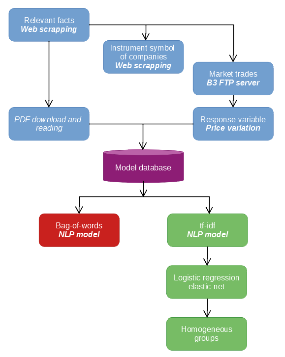
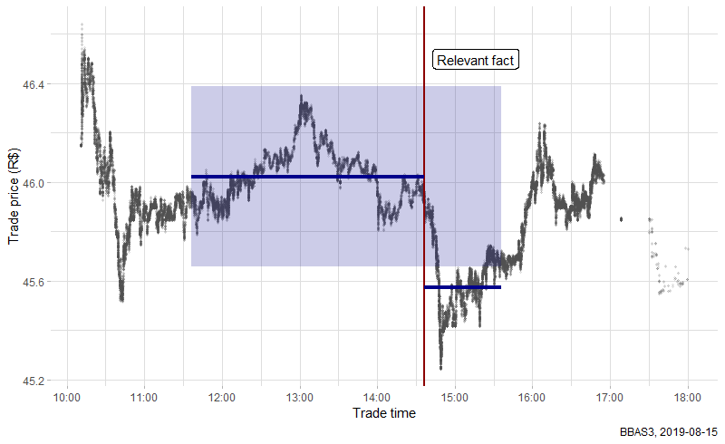
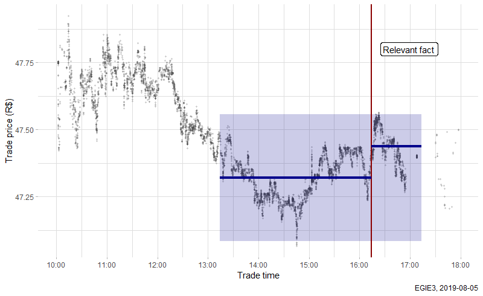

<style>
p.caption {
  font-style: italic;
}
</style>

\

# Introduction {-#introduction}

```{r echo=FALSE, warning=FALSE}
library(kableExtra)

knitr::opts_chunk$set(eval = FALSE, message = FALSE, warning = FALSE)
```

*Insider information* is a non-public fact any which can be used to gain advantage in stock market's trades. The use of this information in trading is an illegal practice in many contries, called *insider trading*. Insider trading is a rare occurence, however, its monitoring is important to safeguard the broker's image and trust before its clients and regulators.

In Brazil, the *Comissão de Valores Imobiliários* (**CVM**, Real State Comission) requires that companies listed in the national stock market ([B3](http://www.b3.com.br/en_us/)) inform relevant market facts to the public. Some of these published facts can have more or less impact on stock prices. For example, economic data can orientate investors' decisions, while changes in internal committee rules should not affect the market.

In this project, a model based on *Natural Language Processing* (NLP) techniques is developed to help in the identification of possible cases of insider trading by reading and classifying documents of relevant facts according to the impact in the stock prices.

The content is divided in three sections:

* In Section 1, "Data mining and wrangling", I show how data gathering of different sources and formats was done to create the model's variables.

* In Section 2, "Modelling", we examine the results of the NLP model using linear regression with *elastic net* regularization. The results are divided in homogeneous groups, similarly to common techniques applied in Credit Scoring, with the goal of selecting critical cases for analysts.

* Section 3, "Conclusion", presents suggestions for applications as well as improvements to the baseline model developed.

The project uses many extenal sources to build the model database. The figure below is a flow scheme of each step to be detailed in the following sections.

\

```{r eval=TRUE, echo=FALSE, fig.cap="Project flow scheme.", out.width="60%", fig.align="center"}

```

\

## Notes {-#notes}

* The codes are written mainly in `R` language (including this document, in R Markdown). Cases where codes are written in `Python` or `SQL` are duly indicated in the text.

* Due to the big size of the data files, as stock market trades, those are not fully included. It is possible to find examples of some of those processed files in the `GitHub` repository.

* The following R packages are used in the project. For better reading, the packages are indicated as comments at the beginning of the code chunk as necessary.

```{r eval=TRUE}
library(readr)      # Read files
library(dplyr)      # Data manipulation
library(stringr)    # String manipulation
library(lubridate)  # Date and time manipulation
library(rvest)      # Web scrapping
library(curl)       # Web client
library(xml2)       # Web scrapping
library(purrr)      # Functional programming
library(hms)        # Time-of-day tools
library(bizdays)    # Business days utilities
library(vroom)      # Fast file reading
library(data.table) # Data manipulation
library(httr)       # HTTP tools
library(pdftools)   # PDF reading
library(tm)         # Text mining
library(caret)      # Classification and regression models
library(ggplot2)    # Data visualization
```

\

# Data mining and wrangling {#data-mining}

## Web scrapping of relevant facts {#web-scrapping}

Relevant market facts can be consulted by date or company in the [CVM website](https://www.rad.cvm.gov.br/ENET/frmConsultaExternaCVM.aspx). Due to the website structure, it is necessary to create a webdriver process to get relevant fact records of each month in an automated way. The code below, in `Python`, uses the [Selenium](https://selenium-python.readthedocs.io/) webdriver to web scrap information. It needs just the start and end dates of the desired month (variable `dates`).

```{python web_scrap}
# PYTHON 3 CODE

from selenium import webdriver
from selenium.webdriver.common.by import By
from selenium.webdriver.support.ui import WebDriverWait
from selenium.webdriver.support import expected_conditions as EC

import pandas as pd
import numpy as np

# Set start and end dates -----------------------------------------------------
dates = pd.date_range(start = "2019-10-01", end = "2019-10-31")


# Using Chrome browser
driver = webdriver.Chrome("C:/seleniumDriver/ChromeDriver/chromedriver.exe")
driver.get("https://www.rad.cvm.gov.br/ENET/frmConsultaExternaCVM.aspx")

wait = WebDriverWait(driver, 60)
element = wait.until(EC.element_to_be_clickable((By.ID, "rdPeriodo")))

driver.find_element_by_id("rdPeriodo").click()

wait = WebDriverWait(driver, 3)
element = wait.until(EC.element_to_be_clickable((By.ID, "txtDataIni")))

relevant_facts = pd.DataFrame()

for date in dates:
    driver.find_element_by_id("txtDataIni").clear()
    driver.find_element_by_id("txtDataIni").send_keys(date.strftime("%d/%m/%Y"))

    driver.find_element_by_id("txtDataFim").clear()
    driver.find_element_by_id("txtDataFim").send_keys(date.strftime("%d/%m/%Y"))

    driver.find_element_by_id("btnConsulta").click()

    wait = WebDriverWait(driver, 180)
    element = wait.until(EC.invisibility_of_element_located((By.ID, "divLoading")))
    
    df = pd.DataFrame()

    while True:
        table = driver.find_element_by_id("grdDocumentos").get_attribute("outerHTML")
        table = pd.read_html(table, encoding = "latin-1")
        table = table[0]
        
        col = []
        
        if table.iloc[0, 0] != "Não há dados disponíveis":
            for i in range(len(table.index)):
                dl_xpath = '//*[@id="grdDocumentos"]/tbody/tr[' + \
                            str(i + 1) + ']/td[11]/i[2]'
                # Get file download parameters
                dl = driver.find_element_by_xpath(dl_xpath).get_attribute("onclick")
                
                col += [dl]
            
            table["download"] = col
            
            df = df.append(table)
        
        if "disabled" in driver.find_element_by_id("grdDocumentos_next").get_attribute("class"):
            break
        else:
            driver.find_element_by_id("grdDocumentos_next").click()
    
    relevant_facts = relevant_facts.append(df)
    
    driver.find_element_by_id("filtrosPesquisa").click()
    
    wait = WebDriverWait(driver, 3)
    element = wait.until(EC.element_to_be_clickable((By.ID, "txtDataIni")))

relevant_facts = relevant_facts.drop(columns = "Ações")

relevant_facts = relevant_facts.replace("-", np.nan)

relevant_facts.columns = ["cvm_code", "company", "category", "type", 
                          "kind", "reference_date", "issue_dttm", 
                          "status", "v", "modality", "download"]

relevant_facts.to_csv(path_or_buf = (
  "datasets/en/relevant_facts_" + date.strftime("%Y%m") + ".csv",
  index = False)

driver.close()
```

The table bellow is an example of the first lines of the generated CSV. The important columns for the model are:

* `cvm_code`: listed company's CVM code
* `company`: company name
* `category`: relevant fact category
* `issue_dttm`: date and time of the relevant fact issue by CVM
* `download`: parameters to download attached files of each relevant fact

We will download the files later because, as we will see, not every file needs to be downloaded. This decision *saves processing time and storage space in the future*.

```{r eval=TRUE, message=FALSE, warning=FALSE, results='asis', fig.cap=""}
# library(readr)
# library(dplyr)
# library(stringr)
# library(lubridate)

relevant_facts <- read_csv("datasets/en/relevant_facts_201908.csv")

# Data cleaning
relevant_facts <- relevant_facts %>%
  filter(status != "Cancelado") %>% 
  select(-(type:reference_date), -(status:modality)) %>% 
  mutate(company = str_sub(company, start = 8),
         issue_dttm = issue_dttm %>% 
           str_sub(start = 10) %>%
           dmy_hm(),
         download = download %>% 
           str_remove_all("OpenDownloadDocumentos\\(|\\)|'") %>%
           str_split(","))
```

\

```{r eval=TRUE, echo=FALSE, results='asis'}
relevant_facts %>% 
  head(10) %>% 
  mutate(issue_dttm = as.character(issue_dttm)) %>% 
  kable() %>%
  kable_styling() %>%
  scroll_box(width = "100%", height = "400px")
```

\

## Companies' instrument symbol

Note that only the `cvm_code` and the `company` name are included in the previous data frame `relevant_facts` but not the instrument symbol traded in the market. So, we need to look for this information somewhere else.

We can consult the [Listed Companies](http://www.b3.com.br/pt_br/produtos-e-servicos/negociacao/renda-variavel/empresas-listadas.htm) in the B3 website to get *some* of the instrument symbols. Not every instrument symbol is listed but it is enough to get the first four characters of the code to find all the instrument symbols related to a company.

For example, the company Petrobras ("PETROLEO BRASILEIRO S.A. PETROBRAS") has PETR3 and PETR4 as listed instrument symbols. From the root of the code, **PETR**, it is possible to identify all trades stocks for the company, like **PETR**4F (Equity-Odds) e **PETR**L30 (and many others in the Options market).

We need another web scrapping process, but there is no need to use Selenium again. It is possible to access directly the link for each company from the CVM code `cvm_code` and read the HTML content with the package [rvest](https://github.com/tidyverse/rvest), which makes this process simpler and faster.

```{r instr_symbol}
# library(rvest)

cvm_codes <- file_path %>% 
  read_csv() %>% 
  pull(cvm_code) %>% 
  str_remove("-") %>% 
  as.numeric() %>% 
  unique()

extract_instr_symbol <- function(code) {
  url <- paste0("http://bvmf.bmfbovespa.com.br/cias-listadas/empresas-listadas/",
                "ResumoEmpresaPrincipal.aspx?codigoCvm=", code)
  
  read_html(url) %>% 
    html_nodes("iframe") %>% 
    magrittr::extract(2) %>% 
    html_attr("src") %>%
    str_remove("../../") %>% 
    str_c("http://bvmf.bmfbovespa.com.br/", .) %>% 
    read_html() %>%
    html_nodes('table[class="ficha responsive"]') %>% 
    html_children() %>% 
    magrittr::extract(2) %>% 
    html_nodes("a") %>% 
    html_text() %>% 
    setdiff("Mais Códigos")
}

instrument_symbols <- purrr::map(cvm_codes, extract_instr_symbol)

df_instr <- purrr::map2_dfr(
  instrument_symbols, cvm_codes,
  ~ tibble(code = .y, instr_symbol = paste(.x, collapse = ", "))
  ) %>% 
  filter(instr_symbol != "")

relevant_facts <- relevant_facts %>%
  mutate(code = as.numeric(str_remove(cvm_code, "-"))) %>% 
  left_join(df_instr, by = "code") %>% 
  select(-code)
```

\

## Stock market trades

B3 freely publishes (anonymous) data of all trades in the brazilian stock market on its FTP server [Market Data](ftp://ftp.bmf.com.br/marketdata)[^bdi1].

[^bdi1]: Sadly, B3 annouced a few months ago that it will shut down the free FTP server to replace it with a new paid server.

Trades are available in the markets:

* Equity

* Equity-Odds

* Options

* BMF

A great differential in relation to other popular free services, like [Yahoo Finance](https://finance.yahoo.com/), is the detail level of data: there are records with microseconds precision for each trade. This allows more diverse research, as we are not confined in daily aggregations.

The data is stored in compressed text files (.zip/.gz) divided by market type and trade date. The code below defines three functions, `bdi_get_ftp()`, `bdi_download()` and `bdi_read()`, to locate, download and read those raw files. The functions are strongly inspired in the [GetHFData](https://cran.r-project.org/web/packages/GetHFData/index.html) package. We are going to deal only with trade files (`NEG_***`). The [complete structure](ftp://ftp.bmf.com.br/marketdata/NEG_LAYOUT_english.txt) of the files can be consulted in the Market Data FTP server.

> Some files are large: about 1 GB when decompressed! CSV files of ~350 MB are generated at the end of the processing. For this reason, it may be needed to process the files in chunks depending on the memory capacity.

```{r bdi_functions}
# require(curl)
# require(xml2)


bdi_get_ftp <- function(market_type = c("Equity", "Equity-Odds", "Options", "BMF"), 
                        data_type = c("trades", "orders")) {
  # Reads the FTP server contents for trades/orders of a specified market type
  # and returns a data frame containing information about the available files
  # for download.
  
  # Arguments:
  # `market_type`   Market type as divided by B3
  # `data_type`     File type: trades or orders
  
  market_type <- match.arg(market_type)
  
  data_type <- match.arg(arg = data_type)
  
  if (!curl::has_internet()) {
    stop("Internet connection not found.")
  }
  
  ftp_path <-  paste0(
    "ftp://ftp.bmf.com.br/MarketData/",
    case_when(
      any(market_type == c("Equity", "Equity-Odds")) ~ "Bovespa-Vista/",
      market_type == "Options"                       ~ "Bovespa-Opcoes/",
      market_type == "BMF"                           ~ "BMF/"
    )
  )
  
  if (data_type == "trades") {
    files_pattern <- "NEG_(.*?)\\.(zip|gz)"
  } else {
    files_pattern <- "OFER_(.*?)\\.(zip|gz)"
  }
  
  cat("Reading ftp contents for ", market_type, " (", data_type, ")\n", sep = "")
  
  ftp_files <- read_html(ftp_path) %>%
    xml_find_all("//tr") %>%
    xml_children() %>%
    xml_text(trim = TRUE) %>%
    matrix(ncol = 4, byrow = TRUE) %>%
    `[`(c(-1, -2), c(-1, -4))
  
  tbl_ftp <- tibble(
    market = market_type,
    file_name = ftp_files[, 1],
    date = str_extract(ftp_files[, 1], pattern = "[0-9]{8}"),
    file_size = case_when(
      str_detect(ftp_files[, 2], "MB") ~ 
        as.numeric(str_extract(ftp_files[, 2], "[0-9]+")) * 1024^2,
      str_detect(ftp_files[, 2], "KB") ~ 
        as.numeric(str_extract(ftp_files[, 2], "[0-9]+")) * 1024,
      str_detect(ftp_files[, 2], "bytes") ~ 
        as.numeric(str_extract(ftp_files[, 2], "[0-9]+")),
      TRUE ~ NA_real_
    ),
    url = paste0(ftp_path, ftp_files[, 1])
  ) %>%
    mutate(date = ymd(date)) %>%
    filter(str_detect(file_name, pattern = files_pattern))
  
  # remove or not FRAC market files
  if (market_type == "Equity-Odds") {
    tbl_ftp <- filter(tbl_ftp, str_detect(file_name, pattern = "FRAC"))
  } else {
    tbl_ftp <- filter(tbl_ftp, str_detect(file_name, pattern = "FRAC", negate = TRUE))
  }
  
  if (data_type == "orders") {
    tbl_ftp <- tbl_ftp %>%
      mutate(order_type = ifelse(str_detect(file_name, pattern = "VDA"),
                                 "Sell", "Buy")) %>% 
      select(market, order_type, everything()) %>% 
      group_by(order_type)
  }
  
  tbl_ftp <- tbl_ftp %>% 
    mutate(file_warning = file_size < mean(file_size) - 2 * sd(file_size)) %>% 
    ungroup()
  
  if (sum(tbl_ftp$file_warning) > 0) {
    warning("Some files seem to be corrupted. Consider revising the files ",
            "where `file_warning` column's value is TRUE.")
  }
  
  tbl_ftp
}


bdi_download <- function(file_name, url, file_size, ..., dest_dir = getwd(), max_tries = 10L) {
  # Downloads the specified files from Market Data FTP and invisibly returns
  # the full path of the download file. Best used in conjunction with the output of 
  # `bdi_get_ftp()` function.
  
  # Arguments:
  # `file_name`   File name
  # `url`         URL where the file is located
  # `file_size`   Approximate file size (from FTP server)
  # `dest_dir`    Destiny directory path
  # `max_tries`   Max number of download attempts
  
  dest_file <- paste0(dest_dir, file_name)
  
  if (file.exists(dest_file) & file.size(dest_file) >= file_size) {
    warning("File already exists in destination directory. Skipping download.")
  } else {
    i <- 1L
    
    while (i <= max_tries) {
      download.file(url, dest_file, method = "libcurl")
      
      if (file.size(dest_file) >= file_size) {
        break
      }
      
      cat("File download has failed. Trying again [", 
          i, " of ", max_tries, "]\n", sep = "")
      
      i <- i + 1L
    }
    
    if (i == max_tries) {
      stop("Failed to download file: reached max number of attempts.
           Check connection or try again later.")
    }
  }
  
  invisible(dest_file)
}


bdi_read <- function(file) {
  # Reads and cleans the download filess from Market Data FTP
  #
  # Arguments:
  # `file`    File path
  
  col_names = c("session_date", "instrument_symbol", "trade_number", 
                "trade_price", "traded_quantity", "trade_time", 
                "trade_indicator", "buy_order_date", "buy_order_seq_number", 
                "buy_order_sec_id", "aggro_buy_order_indicator", 
                "sell_order_date", "sell_order_seq_number", "sell_order_sec_id",
                "aggro_sell_order_indicator", "cross_trade_indicator", 
                "buy_member", "sell_member")
  
  cols <- cols_only(session_date = col_date(format = "%Y-%m-%d"),
                    instrument_symbol = col_character(),
                    trade_number = col_integer(),
                    trade_price = col_number(), 
                    traded_quantity = col_number(), 
                    trade_time = col_time(format = "%H:%M:%OS"), 
                    trade_indicator = col_integer(),
                    buy_order_date = col_date(format = "%Y-%m-%d"),
                    buy_order_seq_number = col_character(),
                    buy_order_sec_id = col_character(),
                    aggro_buy_order_indicator = col_integer(), 
                    sell_order_date = col_date(format = "%Y-%m-%d"),
                    sell_order_seq_number = col_character(),
                    sell_order_sec_id = col_character(),
                    aggro_sell_order_indicator = col_integer(),
                    cross_trade_indicator = col_integer(),
                    buy_member = col_number(),
                    sell_member = col_number())
  
  cat("Reading `", file, "`\n", sep = "")
  
  df <- suppressWarnings(
    read_delim(file, delim = ";", 
               escape_double = FALSE, 
               col_names = col_names, 
               col_types = cols,
               trim_ws = TRUE, 
               skip = 1)) %>%
    # Remove canceled trades
    filter(!is.na(session_date), trade_indicator == 1L) %>%
    mutate(trade_date_time = ymd_hms(paste(session_date, trade_time),
                                     tz = "America/Recife"))
  
  df
}
```

These function can be used in combination with the [purrr](https://purrr.tidyverse.org/) package to process the trade data of the whole month. Note that in order to download the data for a specific month, as Octuber in the code below, I also include the **last day of the previous month** and the **first day of the next month**. The reason for this will be clear when we define the response variable of the model.

```{r bdi_processing}
# library(purrr)

markets <- c("Equity", "Equity-Odds", "Options", "BMF")

ftp_files <- map_dfr(markets, bdi_get_ftp) %>%
  filter(date >= "2019-09-30", date <= "2019-11-01")

ftp_files %>%
  select(file_name, url, file_size) %>%
  pwalk(bdi_download, dest_dir = "datasets")

bdi_raw <- map2_dfr(.x = tbl_files$file_name, .y = tbl_files$market,
                    ~ bdi_read(.x) %>%
                      mutate(market = factor(.y, levels = markets))) %>%
  arrange(session_date, instrument_symbol, trade_time)
```

Each trade day can be stored in a CSV file, for example. The table below is an example of the first lines of the trade day 2019-08-01.

\

```{r eval=TRUE, echo=FALSE}
read_csv("datasets/2019-08-01-BDI-Raw (example).csv") %>% 
  kable() %>%
  kable_styling() %>%
  scroll_box(width = "100%", height = "400px")
```

\

## Response variable

The trade data previously obtained will be used to make a response variable that identifies if there is a significant variation in the price of a company's instrument symbol after the publication of a relevant fact. *Not necessarily* the variation detected is due to the relevant fact.

\

### Definition

The response variable `response_price` is a logical variable (`TRUE`/`FALSE`) defined as follows:

1. Calculate the mean $\mu_{before}$ and standard deviation $\sigma_{before}$ of the prices for **each instrument symbol** of the company within the period of **three hours before** the relevant fact;

2. Calculate the mean $\mu_{after}$ of prices for **each instrument** of the company within the period of **one hour after** the relevant fact;

3. If $|\mu_{after} - \mu_{before}| > 3 \sigma_{after}$ for *at least one instrument symbol* of the company, the response variable is set to `TRUE`;

4. Otherwise, the response variable is set to `FALSE`. If it is not possible to calcute the standard deviation because there are not enough data points (none or one), the response variable is set to `NA`.

The figures below are positive (`TRUE`) and negative (`FALSE`) examples, respectively, of the response variable for two instrument symbols. Both plots show an easy way to visualize the response variable: if the mean of the price after the relevant fact is outside the "tunnel" of $\pm 3 \sigma$ then the response is positive.

\

```{r bbas3, eval=TRUE, echo=FALSE, fig.cap="Positive response variable. Mean after the relevant fact outside the tunnel of 3 standard deviations in relation to the mean before the fact.", out.width="90%", fig.align="center"}

```

\

```{r egie3, eval=TRUE, echo=FALSE, fig.cap="Negative response variable. Mean after the relevant fact inside the tunnel of 3 standard deviations in relation to the mean before the fact.", out.width="90%", fig.align="center"}

```

\

The period computation considers more particular cases. The [market trades' schedule](http://www.b3.com.br/pt_br/solucoes/plataformas/puma-trading-system/para-participantes-e-traders/horario-de-negociacao/acoes/) happens on working days from 10:00 to 18:00 -- offer cancellations or after-market schedule are not considered. On ther other hand, the relevant facts can be published at any day or time.

Thus, if a relevant fact is published outside the trade schedule or at a weekend/holiday, the last or next hours available are used to define the periods before and after the publishing, respectively. Besides that, facts published between 10:00 and 11:00 or between 17:00 and 18:00, this hour is complemented similarly to the previous rule.

In the code below, the lower and upper limits of the periods before and after the publisng of a relevent fact, `dttm_before` and `dttm_after`, are computed. These limits are parameterized according to the variables `delta_before` and `delta_after` (in minutes) that define the observed time window. The package [bizdays](http://wilsonfreitas.github.io/posts/bizdays-dias-uteis-no-r.html) offers many conviniences for calculations with working days in the calendar of the Brazilian Association of Financial and Capital Market ([ANBIMA](https://www.anbima.com.br/feriados/feriados.asp)) -- or any other calendar.

At the end, relevant facts of companies in which it was not found an instrument symbol (*i.e.* when `is.na(root_instr)`) are excluded.

```{r response_processing}
# library(hms)
# library(bizdays)

bizdays.options$set(default.calendar = "Brazil/ANBIMA")

delta_before <- 3 * 60 # 180 minutes
delta_after <- 60      #  60 minutes

n_sd <- 3L # Number of standard deviations for the tunnel


relevant_facts <- relevant_facts %>% 
  mutate(root_instr = str_sub(instr_symbol, end = 4)) %>% 
  mutate(
    # dttm_before = inferior limit of period before `issue_dttm`
    dttm_before = case_when(
      !is.bizday(issue_dttm) | hour(issue_dttm) < 10 ~ 
        as_hms((18 * 60 - delta) * 60) %>% 
        as.character() %>% 
        paste(add.bizdays(date(issue_dttm), -1), .) %>%
        ymd_hms(),
      hms::as_hms(issue_dttm) < (10 * 60 + delta) * 60 ~ 
        as_hms(18 * 60 * 60 - ((10 * 60 + delta) * 60 - as_hms(issue_dttm))) %>% 
        as.character() %>%
        paste(add.bizdays(date(issue_dttm), -1), .) %>%
        ymd_hms(),
      hour(issue_dttm) >= 18 ~ 
        as_hms((18 * 60 - delta) * 60) %>%
        as.character() %>% 
        paste(date(issue_dttm), .) %>%
        ymd_hms(),
      TRUE ~ issue_dttm - minutes(delta)
    ),
    # dttm_after = superior limit of period after `issue_dttm`
    dttm_after = case_when(
      !is.bizday(issue_dttm) | hour(issue_dttm) >= 18 ~
        as_hms((10 * 60 + delta) * 60) %>% 
        as.character() %>% 
        paste(add.bizdays(date(issue_dttm), 1), .) %>%
        ymd_hms(),
      hms::as_hms(issue_dttm) > (18 * 60 - delta) * 60 ~ 
        as_hms(10 * 60 * 60 + (as_hms(issue_dttm) - (18 * 60 - delta) * 60)) %>% 
        as.character() %>%
        paste(add.bizdays(date(issue_dttm), 1), .) %>%
        ymd_hms(),
      hour(issue_dttm) < 10 ~ 
        as_hms((10 * 60 + delta) * 60) %>%
        as.character() %>% 
        paste(date(issue_dttm), .) %>%
        ymd_hms(),
      TRUE ~ issue_dttm + minutes(delta)
    )
  ) %>%
  filter(!is.na(root_instr))
```

To compute the response variable, we need to calculate the mean and standard deviation for each instrument symbol related to a company for each relevant fact published in a given time. We are looking for trades in the dataset `bdi_raw`, but filtering different periods and instruments for each line of `relevant_facts` to, then, calculate the summary quantities.

First, let's load the market data files previously processed.

> Note that, as mentioned, the trade data of the last day of the previous month and the first day of the next month are also loaded because of the way relevant facts published outside the trade schedule are handled.

```{r}
# library(vroom)

file_paths <- list.files("BDI-Raw/", pattern = "BDI-Raw", full.names = TRUE)

bdi_raw <- file_paths %>%
  purrr::map_dfr(vroom, ",", col_types = cols_only(session_date = "D",
                                                   trade_time = "c",
                                                   instrument_symbol = "c",
                                                   trade_price = "d",
                                                   traded_quantity = "d")) %>%
  mutate(root_instrument = str_sub(instrument_symbol, 1, 4)) %>% 
  filter(trade_time >= "10:00:00.000", trade_time <= "18:00:00.000",
         root_instrument %in% unique(relevant_facts$root_instr)) %>%
  mutate(trade_dttm = ymd_hms(paste(session_date, trade_time))) %>% 
  select(-session_date, -trade_time) %>% 
  filter(market != "Options", 
         market == ("BMF" | 
                      nchar(instrument_symbol) <= 6 | 
                      str_detect(instrument_symbol, "F$"))
         )
```

The last `filter` excludes the instrument symbols of the Options market (actually, some symbols of Options are included in Equity files). We do this because the Options market have many granular instruments, usually traded at lower prices and in a lower volume in relation to equities, what can destabilize the response variable. The figures below illustrate this problem for instruments of Bradesco Bank. Note that the granularity of dozens of Options' instruments symbols (BBDCH348, BBDCH358, ...) generates a false perception of the price oscillation as it is more sensible to small variations.

\

```{r bbdcTodos, eval=TRUE, echo=FALSE, fig.cap="All instruments' trades of Bradesco. Shares in Options market have distinct prices and quantities from Equity and Equity-Odds markets.", out.width="90%", fig.align="center"}

```

\

```{r bbdcGrid, eval=TRUE, echo=FALSE, fig.cap="Illustration of response variable computation for Equity + Equity-Odds and Options markets. The granularity and lower volume of Options may unbalance the computation of the response variable.", out.width="90%", fig.align="center"}

```

\

### Computation

In a `SQL` query, the computation of the mean and standard deviation could be done as follows for a period *before* the relevant fact (and similarly for the period *after* the fact):

```{sql connection=NULL}
-- SQL CODE

SELECT fr.doc_id,
       bdi.instrument_symbol,
       MEAN(bdi.trade_price) AS before_price_mean,
       STDEVP(bdi.trade_price) AS before_price_sd
FROM relevant_facts AS fr
LEFT JOIN bdi_raw as bdi
  ON (fr.root_instr = bdi.root_instrument) AND
     (bdi.trade_dttm BETWEEN fr.dttm_before AND fr.issue_dttm)
GROUP BY fr.doc_id, bdi.instrument_symbol;
```

This type of query is called *non-equi join*, where we have a `JOIN` operation done under an inequality condition (`>`, `<=`, `BETWEEN`, ...). It is not possible to do this type of operation directly with `dplyr::left_join()` followed by `dplyr::summarise()` because the first function only works in equality conditions. While it is possible to call `left_join()` for all date-times and then call `filter()`, the amount of data renders this operation infeasible.

The first attempt, still using `dplyr` and `purrr`, was to define a function `dplyr_summarise_facts()` and apply it to every line of `relevant_facts`.

```{r}
dplyr_summarise_facts <- function(
  doc_id, root_instr, issue_dttm, dttm_before, dttm_after, ..., .side
  ) {
  .side <- match.arg(.side, c("before", "after"))
  
  if (.side == "before") {
    dttm_interval <- interval(dttm_before, issue_dttm)
  } else {
    dttm_interval <- interval(issue_dttm, dttm_after)
  }
  
  result <- bdi_raw %>%
    filter(root_instrument == root_instr,
           trade_dttm %within% dttm_interval) %>%
    group_by(instrument_symbol) %>% 
    summarise(n = n(),
              price_mean = mean(trade_price),
              price_sd = sd(trade_price)) %>%
    rename_at(c("n", "price_mean", "price_sd"), ~ paste0(.side, "_", .)) %>% 
    mutate(doc_id = doc_id)
}

before <- purrr::pmap_dfr(relevant_facts, dplyr_summarise_facts, .side = "before")

after <- purrr::pmap_dfr(relevant_facts, dplyr_summarise_facts, .side = "after")
```

However, this function is inefficient: about two hours to run a month of relevant facts. The main bottleneck is that the `filter()` function is called one time for each instrument symbol related to a relevant fact, making copies in the process, to then compute the summary quantities with `summarise()`.

The `data.table` package offers a scalable alternative for this case[^dt] as it is possible to perform non-equi join operations. Using this alternative, each month is processed in about 3 minutes!

[^dt]: Thanks to **\@Fino** for the help in conversion of the `dplyr` function to `data.table` in [StackOverflow](https://stackoverflow.com/questions/59504357/filtering-and-summarising-a-dataframe-based-another-search-dataframe).

```{r dt_summarise}
# library(data.table)

dt_summarise_fatos <- function(.facts, .side) {
  .side <- match.arg(.side, c("before", "after"))
  
  setDT(.facts)
  setDT(bdi_raw)
  
  if (.side == "before") {
    df <- bdi_raw[.facts,
                  on = .(trade_dttm >= dttm_before, 
                         trade_dttm <= issue_dttm, 
                         root_instrument = root_instr),
                  .(doc_id, 
                    root_instr,
                    dttm_before, 
                    issue_dttm, 
                    trade_dttm,  
                    instrument_symbol, 
                    root_instrument,
                    traded_quantity, 
                    trade_price)]
  } else {
    df <- bdi_raw[.facts,
                  on = .(trade_dttm >= issue_dttm, 
                         trade_dttm <= dttm_after, 
                         root_instrument = root_instr),
                  .(doc_id, 
                    root_instr,
                    dttm_before, 
                    issue_dttm, 
                    trade_dttm,  
                    instrument_symbol, 
                    root_instrument,
                    traded_quantity, 
                    trade_price)]
  }
  
  df <- df[, 
           list(n = .N,
                price_mean = mean(trade_price),
                price_sd = sd(trade_price)),
           by = list(doc_id, instrument_symbol)]
  
  df %>% 
    as_tibble() %>% 
    rename_at(c("n", "price_mean", "price_sd"), ~ paste0(.side, "_", .)) %>% 
    filter(!is.na(instrument_symbol))
}

before <- dt_summarise_fatos(relevant_facts, "before")

after <- dt_summarise_fatos(relevant_facts, "after")

relevant_facts <- relevant_facts %>%
  left_join(before, by = "doc_id") %>% 
  left_join(after, by = c("doc_id", "instrument_symbol")) %>% 
  as_tibble()
```

Finally, we can compute the response variable `response_price`. We are disregarding the relevant facts where it was not possible to calculate the standard deviation (*i.e.* when `response_price` is `NA`).

```{r}
price_alerts <- relevant_facts %>% 
  mutate(response_price = 
           abs(after_price_mean - before_price_mean) > n_sd * before_price_sd) %>%
  filter(!is.na(response_price)) %>% 
  mutate(instrument_symbol = if_else(response_price, instrument_symbol, "")) %>% 
  group_by(file_name) %>% 
  summarise(response_price = sum(response_price) > 0,
            ativo_response = instrument_symbol %>% 
              str_c(collapse = " ") %>% 
              str_squish() %>% 
              na_if(""))

fatos_final <- relevant_facts %>% 
  left_join(price_alerts, by = "file_name") %>% 
  filter(!is.na(response_price))
```

\

## Download and read PDFs

The last step to complete the data needed for the model is to get the documents emited for each relevant fact. Analyzing the source-code of [CVM's relevant facts page](https://www.rad.cvm.gov.br/ENET/frmConsultaExternaCVM.aspx), it was possible to find the link for each attached document. The link parameters are given by the arguments of the function `OpenDownloadDocumentos()` of the page, that was converted into a character vector in the column `relevant_facts$download` (see Subsection 1.1).

In the code below, the function `download_attachment()` downloads only PDF files, as some attachments are images or XML files of varying structure. If an file extension is not **.pdf**, the function returns `"NONE"`. If an error in downloading occurs (for connection problems, for example), it returns `"ERROR"`, then we can try to download again until there are no more files with error. At the end, **relevant facts where it was not possible to download a PDF attachment are disregarded**.

```{r}
# library(httr)

download_attachment <- function(download_params, dest_dir, n_attempt = 5L) {
  # Downloads the attached PDF files from a relevant fact record
  #
  # Arguments:
  # `download_params`   Parameters of download link, as a string vector
  # `dest_dir`          Directory path to save file
  # `n_attempt`         Max number of download attempts
  
  url <- str_glue(
    "https://www.rad.cvm.gov.br/ENET/frmDownloadDocumento.aspx?Tela=ext",
    "&numSequencia={download_params[1]}",
    "&numVersao={download_params[2]}",
    "&numProtocolo={download_params[3]}",
    "&descTipo={download_params[4]}",
    "&CodigoInstituicao=1")
  
  try(
    extension <- httr::HEAD(url)$headers$`content-disposition` %>% 
        str_extract("(?<=filename=).*") %>% 
        tools::file_ext()
  )
  
  if (!exists("extension")) return("ERROR")
  
  if (!is.na(extension) & extension == "pdf") {
    file_name <- paste(download_params, collapse = "-")
    
    attempt <- 0L

    while (!exists("dl") & attempt < n_attempt) {
      try(
        dl <- download.file(url, str_glue("{dest_dir}/{file_name}.pdf"), mode = "wb")
      )

      attempt <- attempt + 1L

      Sys.sleep(0.2)
    }

    if(attempt == n_attempt) file_name <- "ERROR"
    
  } else file_name <- "NONE"
  
  file_name
}

dest_path <- "attachments"

relevant_facts$file_name <-  purrr::map_chr(
  relevant_facts$download,  ~ download_attachment(., dest_dir = dest_path)
  )

# If "ERROR" returned, try to download again
while (sum(relevant_facts$file_name == "ERROR") != 0) {
  file_names <- relevant_facts %>% 
    filter(file_name == "ERROR") %>% 
    pull(download) %>% 
    purrr::map_chr(~ download_attachment(., dest_dir = dest_path))
  
  relevant_facts[relevant_facts$file_name == "ERROR", "file_name"] <- file_names
}

# Clean `file_name` and remove relevant facts with no attached PDF file
relevant_facts <- relevant_facts %>% 
  mutate(file_name = if_else(file_name == "NONE", NA_character_, file_name)) %>% 
  select(-download) %>% 
  filter(!is.na(file_name))
```

Now, we read the contents (all pages) of the PDF files using the [pdftools](https://cran.r-project.org/web/packages/pdftools/index.html) package. Some files may be corrupted or with an incompatible structure with `pdftools::pdf_text()`. Thus, **relevant facts where it was not possible to read the PDF or with empty content are also disregarded**.

```{r}
# library(pdftools)

read_pdf <- function(pdf_name, dir_path) {
  try({
    text <- str_glue("{dir_path}/{pdf_name}.pdf") %>% 
      pdftools::pdf_text() %>% 
      paste(collapse = " ")
  })
  
  if (exists("text", mode = "character")) text else "ERROR"
}

relevant_facts$pdf_content <- relevant_facts$file_name %>% 
  purrr::map_chr(read_pdf, dir_path = dest_path) %>% 
  str_trim() %>% 
  na_if("ERROR")

relevant_facts <- filter(relevant_facts, !is.na(pdf_content))
```

\

# Modeling {#modeling}

Completed the data structuring, we finally enter the stage of model building. Remember that of all relevant facts published by CVM we are dealing with only a subset due to some difficulties on the processing. Relevant facts are excluded if:

* The company does not have an instrument symbol listed in B3;

* It is not possible to compute the response variable `response_price` due to low trades within the period;

* They do not have a PDF file attached;

* It was not possible to read the PDF file or its content is empty

> The full data structuring process was done for three months. So, from now on, the dataframe `relevant_facts` used to build the model includes the months of **August, September and Octuber 2019**.

\

## NLP Model

Each text `relevant_facts$pdf_content` is pre-processed to eliminate words or expressions that do not add significant results to the NLP model, like common words (*stop words*), digits or web links. As the documents may contain both text in Portugues and English, the pre-processing tries to account for cleaning in both languages. The operations performed, in the same order as the following code, are:

1. Convert words to lower case
2. Remove accents
3. Remove website links and e-mail addresses
4. Remove punctuation and numbers
5. Remove common special characters (ª, º, |)
6. Remove stop words
    + List of stop words in Portuguese (muito, sua, foi, ...) and English (the, my, how, ...)
    + Months both abbreviated and non-abbreviated (Portuguese and English)
    + Roman numerals (III, LVII) and quantifiers (million, billion)
    + Specific context words
7. Remove words up to two letters or with more than 20 letters

```{r}
# library(tm)

read_pdf <- function(x) {
  try ({
    text <- paste0("attachments/", ano_mes, "/", x, ".pdf") %>% 
      pdftools::pdf_text() %>% 
      paste(collapse = " ")
  })
  
  if (exists("text", mode = "character")) text else ""
}

relevant_facts$pdf_content <- purrr::map_chr(relevant_facts$file_name, read_pdf)

stop_words <- c(stringi::stri_trans_general(stopwords("pt-BR"), "Latin-ASCII"),
                stringi::stri_trans_general(stopwords("en"), "Latin-ASCII"),
                format(ISOdate(2019, 1:12, 1), "%B"), month.name,
                format(ISOdate(2019, 1:12, 1), "%b"), month.abb,
                "sao", "paulo", "rio", "brasil", "brazil",
                "cpf", "cnpj", "cnpjmf", "nire", "sobre", "ser",
                as.roman(1:1000), 
                "bilhao", "bilhoes", "milhao", "milhoes", 
                "mil", "milhares", "centena", "centenas",
                "billion", "billions", "million", "millions", 
                "thousand", "thousands", "hundred", "hundreds") %>% 
  str_to_lower()

relevant_facts <- relevant_facts %>% 
  mutate(pdf_content = pdf_content %>% 
           str_to_lower(locale = "pt-BR") %>%
           stringi::stri_trans_general("Latin-ASCII") %>% 
           str_remove_all("(https?:\\/\\/|www\\.)\\S*\\s?") %>% # Removes website address
           str_remove_all("\\S*@\\S*\\s?") %>% # Removes e-mail address
           removePunctuation() %>%
           removeNumbers() %>%
           str_replace_all("ª|º|\\|", " ") %>% 
           removeWords(stop_words) %>%
           str_remove_all("\\b\\w{1,2}\\b") %>%
           str_remove_all("\\b\\w{20,}\\b") %>% 
           str_remove_all("[^[\\w\\s]]") %>% 
           str_squish() %>% 
           na_if(""))
```

Then, the *corpus*, the set of words in the text documents, is generated and from the `corpus`, the **d**ocument-**t**erm **m**atrix is created, where each line of the matrix represents a document and each collumn is a words of the corpus.

```{r eval=TRUE, echo=FALSE}
relevant_facts <- readRDS(str_glue("datasets/en/facts_pdf_201908.rds")) %>% 
  bind_rows(readRDS(str_glue("datasets/en/facts_pdf_201909.rds"))) %>% 
  bind_rows(readRDS(str_glue("datasets/en/facts_pdf_201910.rds"))) %>%
  mutate(response_price = factor(make.names(response_price))) %>% 
  filter(!is.na(pdf_content), status != "Cancelado")
```


```{r eval=TRUE}
corpus <- relevant_facts %>%
  select(doc_id = file_name, text = pdf_content, 
         cvm_code, company, category, issue_dttm) %>% 
  DataframeSource() %>% 
  VCorpus()
```

\

## Bag-of-words

*Bag-of-words* (BoW) is a simplified model in NLP, because it does not consider the structure or order in which words appear in the text. Each word in the corpus is a column in the document-term matrix, where the matrix value $[a_{ij}]$ indicates how many times the word $j$ appears in document $i$.

```{r eval=TRUE}
bow_dtm <- corpus %>% 
  DocumentTermMatrix() %>% 
  removeSparseTerms(.99) %>% 
  as.matrix()

bow_dtm[1:5, 1:5]
```

The matrix lines have index `doc_id`, an unique value (in this case, the name of the PDF file, `relevant_facts$file_name`) that identifies the document, and the matrix columns are words of the corpus. In the last function `removeSparseTerms()`, we remove words that appear very rarely in document set, that is, where column values are 99% or more zeroes. This helps to lower the dimensionality of the matrix `bow_dtm` by removing terms that do not add much meaning to the model -- from ~97.000 words to ~8.000!).

\

## Tf-idf

The **tf-idf** measures the importance of a word in a document from a collection of documents and is define as:

$$\text{tfidf}(t, d, D) = \text{tf}(t, d) \cdot \text{idf}(t, D)$$
where

* $\text{tf}(t, d)$, *term frequency*, is the number of occurences of the term $t$ in document $d$

* $\text{idf}(t, D) = \log_2 \frac{|D|}{|\{d \in D:\ t \in d\}|}$, *inverse document frequency*, is a measure of how much information a word provides, i.e., if a term is common or rare in relation to all documents. $|D|$ denotes the total number of documents and $|\{d \in D:\ t \in d\}|$ is the number of documents where term $t$ appears.

If a term (word) $t_j$ appears in a document $d_i$, the element $[a_{ij}]$ of matrix `pdf_dtm` has value given by tf-idf, instead of simply the number of times a word appears in each document like in the bag-of-words model. In the same way, we remove sparse terms.

```{r eval=TRUE}
tfidf_dtm <- corpus %>% 
  DocumentTermMatrix(control = list(weighting = weightTfIdf)) %>% 
  removeSparseTerms(.99) %>% 
  as.matrix()

tfidf_dtm[1:5, 1:5]
```

\

## Logistic regression model

To better evaluate the performance of the model, both for bag-of-words and tf-idf, we separate the matrix data in two sets:

* **Training set** with 75% of the data, used to train the model; and

* **Test set** with the other 25% of the data, used to evaluate the results with data not seen by the model previously.

```{r eval=TRUE}
# library(caret)

set.seed(123) # For reproducibility

train_idx <- createDataPartition(relevant_facts$response_price, 
                                 p = .75, list = FALSE)

# Bag-of-words
train_bow <- as.matrix(bow_dtm)[train_idx, ]

test_bow <- as.matrix(bow_dtm)[-train_idx, ]

# tf-idf
train_tfidf <- as.matrix(tfidf_dtm)[train_idx, ]

test_tfidf <- as.matrix(tfidf_dtm)[-train_idx, ]
```

We train a logistic regression model with *elastic net* regularization. This regularization method tries to minimize the residual sum of squares plus a penalty term, that is a linear combination of the Lasso ($L_1$) and Ridge ($L_2$) regularizations, that is,

$$\min_\beta \sum^n_{i=1} \left(y_i - \beta_0 - \sum^p_{j=1} \beta_j x_{ij} \right)^2 + \lambda \left[\alpha ||\beta||_1 + \frac{1 - \alpha}{2} ||\beta||^2_2 \right]$$
where

* $||\beta||^2_2 = \sqrt{\sum^p_{j=1} \beta^2_j}$, and

* $||\beta||_1 = \sum^p_{j=1} |\beta_j|$. 

To determine the optimal values of the hyperparameters $\alpha$ and $\lambda$, we apply the *k*-fold cross-validation method with $k = 5$, using the ROC value as the evaluation metric.

```{r}
control <- trainControl(method = "cv", 
                        number = 5,
                        classProbs = TRUE,
                        savePredictions = "final",
                        summaryFunction = twoClassSummary)

set.seed(2019)

bow_model <- train(x = train_bow,
                   y = relevant_facts$response_price[train_idx],
                   method = "glmnet",
                   family = "binomial",
                   metric = "ROC",
                   trControl = control)

tfidf_model <- train(x = train_tfidf,
                     y = relevant_facts$response_price[train_idx],
                     method = "glmnet",
                     family = "binomial",
                     metric = "ROC",
                     trControl = control)
```

```{r eval=TRUE, echo=FALSE}
load("datasets/models.RData")
```

In the plot below, we can visualize the comparision between the bag-of-words and tf-idf models. The tf-idf model has a slightly better performance but this difference is statistically insignificant. Nevertheless, we will use the tf-idf model as it has lower dimensionality.

\

```{r bowTfidf, eval=TRUE, fig.cap="Comparação dos modelos bag-of-words (BoW) e Tf-Idf.", fig.align="center"}
resamps <- resamples(list(BoW = bow_model, Tf_Idf = tfidf_model))

dotplot(resamps)
```

\

The values of the area under the ROC curve (AUC) of the **test set** are:

```{r eval=TRUE}
roc_bow <- pROC::roc(
  predictor = predict(bow_model, test_bow, type = "prob")$TRUE.,
  response = relevant_facts$response_price[-train_idx]
  )

roc_tfidf <- pROC::roc(
  predictor = predict(tfidf_model, test_tfidf, type = "prob")$TRUE.,
  response = relevant_facts$response_price[-train_idx]
  )
```

```{r eval=TRUE, echo=FALSE}
str_glue("AUC bag-of-words model: {roc_bow$auc}\n",
         "AUC tf-idf model: {roc_tfidf$auc}")
```

\

## Homogeneous groups

The obtained ROC value seems to be only reasonable for a model built from *many sources of real data*, but it still represents an useful model. A way to condense the volume of information and give priorities of alerts to Compliance analysts is to sort the model results in *homogeneous groups* (HG), a technique usually used in *Credit Scoring* analysis to identify higher risk groups.

To separate the predictions into groups, we use the probabilities given by the model and sort the probability distribuition into 20 quantiles. Each quantile contains 5% of the values set. For each group, we count the number of "good" and "bad" events -- in this case, the number of `TRUE` and `FALSE` of the response variable, respectively. From this score we can compute the *odds*, given by:


$$\text{Odds} =  \frac{\text{% of good}}{\text{% of bad}}$$

Sometimes, the weight of evidence (WoE), a logit transformation of odds (that is, $\text{WoE} = \ln (\text{Odds})$), is also computed. We observe WoE values along the 20 homogeneous groups and perform aggregations following two rules:

1. Join *adjacent* groups with similar WoE values; and

2. The WoE values of the new groups must be monotonically increasing or decreasing

This way, we classify the observations into "risk" groups, i.e., with lower or higher probability for an event.

```{r eval=TRUE}
train_hg <- relevant_facts %>% 
  slice(train_idx) %>% 
  select(-pdf_content) %>% 
  mutate(prob = tfidf_model$pred %>% arrange(rowIndex) %>% pull(TRUE.),
         response_price = response_price == "TRUE.")

test_hg <- relevant_facts %>% 
  slice(-train_idx) %>% 
  select(-pdf_content) %>% 
  mutate(prob = predict(tfidf_model, test_tfidf, type = "prob")$TRUE.,
         response_price = response_price == "TRUE.")
```

The `hg_quantiles()` function computes the 20-quantiles interval of a given vector, while the `hg_summary_tbl()` function returns a table of the good and bad counts and WoE values.

```{r eval=TRUE}
hg_quantiles <- function(training, col, join = list()) {
  # Computes the 20-quantiles (5%) intervals of a vector of probabilities. It
  # is possible to join quantiles with the `join` argument.
  #
  # Arguments:
  # `prob`  numeric vector of probabilities
  
  # `join`  list of integer sequences. For example list(2:5, 8:12) to join 
  #         homogeneous groups `hg` 2 to 5 and 8 to 12
  
  quantiles <- training[[col]] %>%
    quantile(seq(0, 1, 0.05)) %>%
    unique()
  
  if(length(join) != 0) {
    join <- join %>%
      purrr::map(~ .[-1]) %>%
      unlist()
    
    quantiles <- quantiles[-join]
  }
  
  quantiles[1] <- -Inf
  quantiles[length(quantiles)] <- Inf
  
  quantiles
}


hg_summary_tbl <- function(df, col, target, quantiles = hg_quantiles(df, col)) {
  # Returns information as a tibble about homogeneous groups in relation to the
  # values of a variable (numeric or categoric)
  # 
  # Arguments:
  # `df`          model dataframe
  # `col`         name of a variable (numeric, character ou factor) as a string
  #               of the separation group
  # `target`      name of the binary (TRUE/FALSE) response variable as a string
  # `quantiles`   quantile intervals computed by `hg_quantiles()`
  
  target_sym <- rlang::sym(target)

  if(is.numeric(df[[col]])) {
    
    for(i in 1:(length(quantiles) - 1)) {
      idx <- df[, col] >= quantiles[i] & df[, col] < quantiles[i + 1]
      
      df[idx, "hg"] <- i
      
      df[idx, "interval"] <- paste0("[", quantiles[i], 
                                    ", ", quantiles[i + 1], "[")
    }
    
    df <- df %>%
      mutate(hg = factor(hg)) %>%
      group_by(hg, interval, add = TRUE) %>%
      summarise(mean_value = mean(!!rlang::sym(col)),
                n_good = sum(!!target_sym),
                n_bad = sum(!(!!target_sym)))
  } else if (is.factor(df[[col]]) | is.character(df[[col]])){
    df <- df %>%
      group_by(!!rlang::sym(col), add = TRUE) %>%
      summarise(n_good = sum(!!target_sym),
                n_bad = sum(!(!!target_sym)))
  } else stop("`col` must be a factor, character or numeric column")
  
  
  df %>%
    ungroup() %>%
    mutate(percent_good = n_good / sum(n_good),
           percent_bad = n_bad / sum(n_bad),
           freq = (n_good + n_bad) / sum(n_good + n_bad),
           mean_good = n_good / (n_good + n_bad),
           odds = percent_good / percent_bad,
           woe = log(odds),
           iv = log(percent_good / percent_bad) * (percent_good - percent_bad),
           ks = abs(cumsum(percent_good) - cumsum(percent_bad)))
}
```

```{r eval=TRUE}
hg20 <- hg_summary_tbl(train_hg, "prob", "response_price") %>% 
  select(hg, n_good, n_bad, percent_good, percent_bad, mean_good, odds, woe)
```

\

```{r eval=TRUE, echo=FALSE}
hg20 %>% 
  kable(digits = 3, col.names = c("HG", "# TRUE", "# FALSE", "% TRUE", "% FALSE", "Mean TRUE", "Odds", "WoE")) %>%
  kable_styling() %>% 
  scroll_box(width = "100%", height = "400px")
```

\

```{r eval=TRUE}
quantiles <- hg_quantiles(train_hg, "prob", 
                          join = list(1:8, 9:12, 13:14, 15:18, 19:20))

hg5 <- train_hg %>% 
  hg_summary_tbl("prob", "response_price", quantiles) %>% 
  select(hg, n_good, n_bad, percent_good, percent_bad, mean_good, odds, woe)
```

\

```{r eval=TRUE, echo=FALSE}
hg5 %>% 
  kable(digits = 3, col.names = c("HG", "# TRUE", "# FALSE", "% TRUE", "% FALSE", "Mean TRUE", "Odds", "WoE")) %>%
  kable_styling()
```

\

We can identify the group to which an observation belongs by the interval given by `gh_quantiles()` and the probability given by the model.

```{r}
train_hg %>%
  bind_rows(test_hg) %>% 
  mutate(hg = findInterval(prob, quantiles))
```

The plot below shows the mean of the response variable along three monts for 5 homogenous groups (training + test sets). If there are crossing lines between groups, we need to review the grouping choices or lower the number of groups. Moreover, it is important that the mean keep an approximately constant behaviour through time for the model to be applied. If this does not happens, there was a change in the observations' pattern.

\

```{r mediaTarget, eval=TRUE, echo=FALSE, fig.cap="Response variable mean along months. The frequency percentages of each group are also shown.", out.width="80%", fig.align="center"}
train_hg %>% 
  bind_rows(test_hg) %>% 
  group_by(month = lubridate::month(issue_dttm)) %>% 
  hg_summary_tbl("prob", "response_price", quantiles) %>%
  ggplot(aes(x = factor(month), y = mean_good, color = hg, group = hg)) +
  geom_line() +
  geom_point() +
  geom_text(data = hg_summary_tbl(train_hg, "prob", "response_price", quantiles),
            aes(x = factor(10), 
                label = scales::percent_format(accuracy = 1)(freq)),
            nudge_x = 0.2, show.legend = FALSE) +
  labs(x = "Reference month", y = "Response mean (good = TRUE)", 
       color = "HG") +
  scale_y_continuous(limits = c(0, NA), labels = scales::percent) +
  theme_light() + 
  theme(panel.border = element_blank())
```

\

Note that group 5, with only 10% of train and test data, is the high "risk" group, that is, it has relevant facts with higher probability of price variation after its publication (when the response variable is `TRUE`).

\

# Conclusion {#conclusion}

In market regulation context, the results of the project could be crossed with (confidential) information of broker's clients to analyze deviations from typical trade behaviour. A change in traded volume days or weeks prior to a relevant fact, that causes impacts in shares' value, could indicate improper use of insider information by clients to obtain advantage in the market. Even so, the analysis of an expert is necessary to give the final veredict about the case.

Possible improvements of the baseline project include from pre-processing steps to the choosing of the Machine Learning model used, as for example:

* Refine the stop words list and apply word [stemming](https://en.wikipedia.org/wiki/Stemming) and [lemmatisation](https://en.wikipedia.org/wiki/Lemmatisation) to the corpus;

* Vary parameters $\delta_{before}$, $\delta_{after}$ and $n_{\sigma}$ of the response variable to better capture its behaviour;

Indeed, I have done tests with ($\delta_{antes}$, $\delta_{depois}$, $n_{\sigma}$) = {(45, 45, 1), (60, 60, 1), (180, 60, 1), (45, 45, 3), (60, 60, 3), (180, 60, 3)} and the last combination got the best relation between the proportion of positive:negative values of the response.

* Evaluate new possibilites for the definition of the response variable that best reflect the market impact;

* Apply more complex NLP models, such as [Word2vec](https://en.wikipedia.org/wiki/Word2vec).